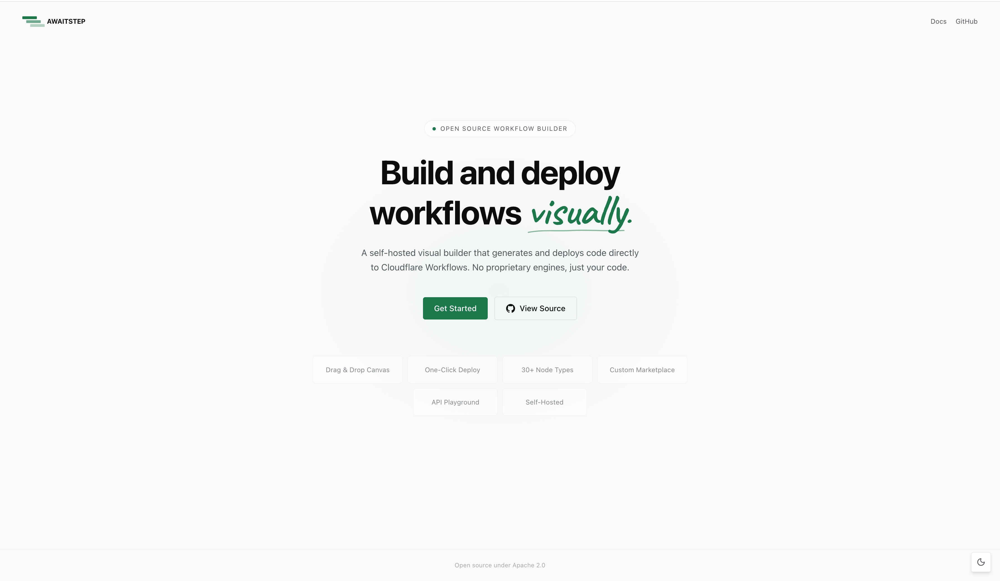
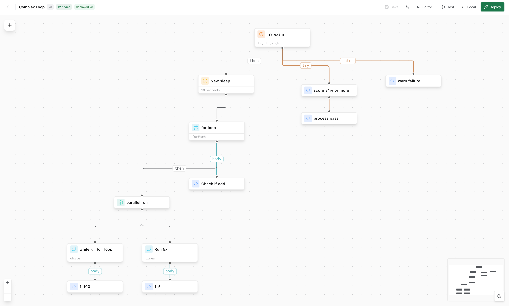
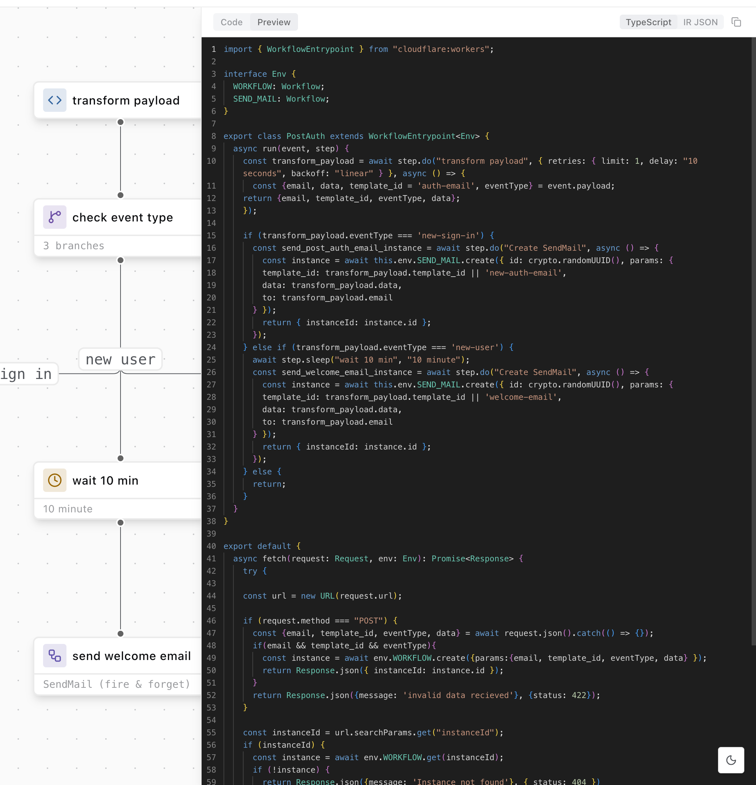
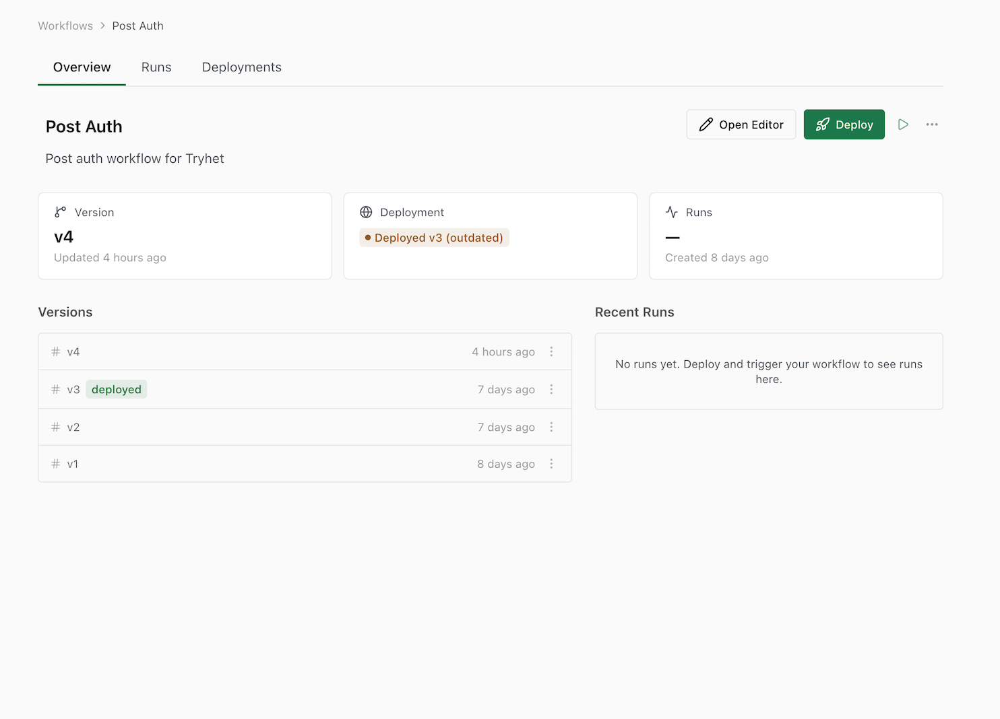

<div align="center">



### Build and deploy workflows _visually_.

A self-hosted visual builder that generates and deploys code directly to [Cloudflare Workflows](https://developers.cloudflare.com/workflows/).
No proprietary engines — just your code.

[](LICENSE)
[](https://docs.awaitstep.dev/installation/cloudflare-workers)

[Get Started](https://docs.awaitstep.dev/installation/docker-compose) &bull; [Documentation](https://docs.awaitstep.dev) &bull; [API Reference](https://docs.awaitstep.dev/api-reference)

</div>

---

## Demo

<!-- TODO: Replace with actual demo video URL -->

https://github.com/user-attachments/assets/PLACEHOLDER

---

<table>
<tr>
<td width="40%" valign="top">

### Visual Canvas

Drag and drop steps, branches, loops, parallel paths, error handling, and more. See your entire workflow structure at a glance — no YAML, no config files.

- Drag-and-drop node placement
- 30+ built-in node types
- Instant undo/redo and keyboard shortcuts

</td>
<td width="60%">



</td>
</tr>
</table>

---

<table>
<tr>
<td width="60%">



</td>
<td width="40%" valign="top">

### Live Code Preview

Every change on the canvas instantly reflects in the code preview. Toggle between generated TypeScript, IR, and the final deployable package. What you see is what gets deployed.

- Real-time TypeScript generation
- IR, TypeScript, and package output views
- No lock-in — eject and own the code anytime

</td>
</tr>
</table>

---

<table>
<tr>
<td width="40%" valign="top">

### Deploy & Monitor

Deploy directly to Cloudflare from the UI. AwaitStep handles code generation, bundling, dependency installation, and deployment. Track version history, lock versions, roll back.

- One-click deploy with version tracking
- Real-time run monitoring with status and errors
- Pause, resume, terminate, and roll back

</td>
<td width="60%">



</td>
</tr>
</table>

---

### Building Blocks

Composable nodes that map directly to Cloudflare Workflow primitives.

| Node             | Description                                  | Node               | Description                                  |
| ---------------- | -------------------------------------------- | ------------------ | -------------------------------------------- |
| **Step**         | Execute custom code with retries and backoff | **Parallel**       | Run steps concurrently                       |
| **Sleep**        | Pause for a duration (up to 365 days)        | **Loop**           | Repeat steps (forEach, while, or count)      |
| **Sleep Until**  | Pause until a specific timestamp             | **Try / Catch**    | Error handling with try/catch/finally        |
| **Branch**       | Conditional execution paths                  | **Exit**           | Break from a loop or return from workflow    |
| **HTTP Request** | Make HTTP calls with configurable retries    | **Wait for Event** | Pause until an external event arrives        |
| **Sub-Workflow** | Trigger another workflow                     | **Custom**         | User-defined node types from the marketplace |

### Features

|                                                                           |                                                                     |                                                                  |
| ------------------------------------------------------------------------- | ------------------------------------------------------------------- | ---------------------------------------------------------------- |
| **Drag & Drop Canvas** — Visual workflow designer with intuitive controls | **One-Click Deploy** — Deploy directly to Cloudflare from the UI    | **30+ Node Types** — Composable building blocks for any workflow |
| **Node Marketplace** — Build, publish, and install custom nodes           | **REST API** — Full API with scoped keys and interactive playground | **Self-Hosted** — Run on your infra — Docker, VPS, or Cloudflare |

---

### Open Source & Self-Hosted

AwaitStep is fully open source under Apache 2.0. Self-host on Docker, a VPS, or Cloudflare — your data never leaves your infrastructure.

Run the entire stack on Cloudflare. API on Workers, builds in sandboxed containers, data in D1.

|      Edge API      |   Sandbox Builds    |    D1 Database     |
| :----------------: | :-----------------: | :----------------: |
| Cloudflare Workers | Isolated containers | SQLite at the edge |

|       **30+**       |   **Apache 2.0**    |      **5 min**       |
| :-----------------: | :-----------------: | :------------------: |
| Built-in node types | Open source license | Self-host setup time |

[](https://docs.awaitstep.dev/installation/cloudflare-workers)

---

## Quickstart

**Prerequisites:** Node.js >= 20, pnpm >= 9

```bash
git clone https://github.com/awaitstep/awaitstep.git
cd awaitstep
cp .env.example .env
```

Generate the required secrets and update `.env`:

```bash
# Generate TOKEN_ENCRYPTION_KEY and BETTER_AUTH_SECRET
openssl rand -hex 32  # run twice, one for each key
```

Then build and start:

```bash
pnpm install
pnpm build
pnpm dev
```

## Documentation

- [Architecture](docs/architecture.md) — System design, data flow, and package structure
- [API Reference](docs/api-reference.md) — All endpoints and database schema
- [Compilation Pipeline](docs/compilation.md) — How canvas IR becomes deployed code
- [Custom Nodes](docs/custom-nodes.md) — Build and publish your own node types

**Built with** TypeScript &bull; React &bull; Hono &bull; Cloudflare Workers

## Security

To report a security vulnerability, see [SECURITY.md](SECURITY.md).

## AI Usage

This project uses AI tools during development. See [AI_USE.md](AI_USE.md) for details.

## Contributing

See [CONTRIBUTING.md](CONTRIBUTING.md) for setup instructions and guidelines.
