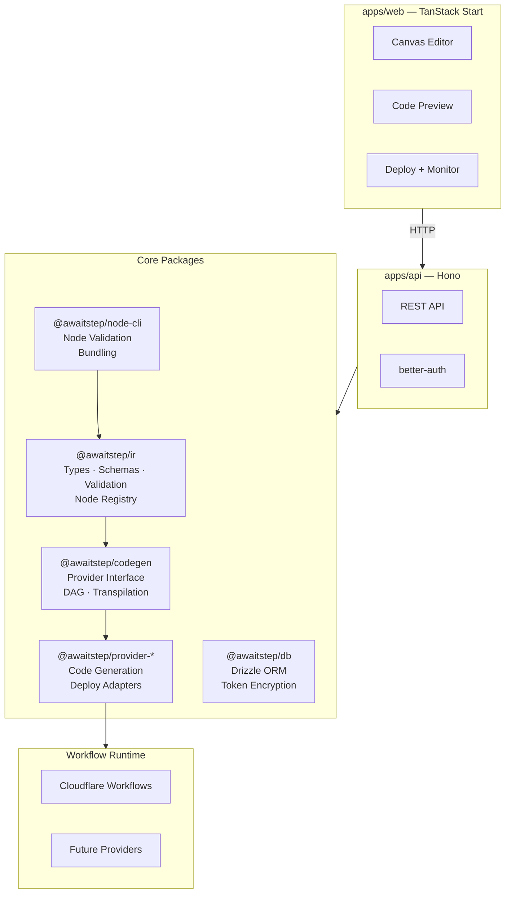
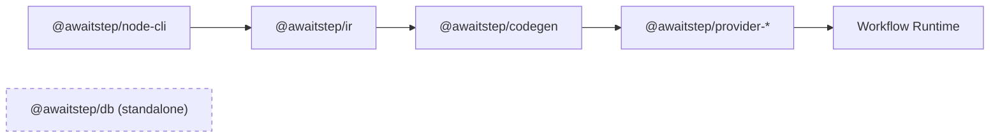

# AwaitStep

Visual workflow builder. Design workflows with drag-and-drop, generate TypeScript code, and deploy to your workflow provider.

**Currently supported:** [Cloudflare Workflows](https://developers.cloudflare.com/workflows/). More providers (e.g. Trigger.dev) planned.

## Features

- **Visual Canvas** — Drag-and-drop workflow designer powered by ReactFlow
- **Live Code Preview** — See generated TypeScript as you build
- **One-Click Deploy** — Deploy directly to your workflow provider
- **Run Monitoring** — Trigger workflows and watch execution in real-time
- **Custom Nodes** — Extend with custom node types via `node-cli`
- **Environment Variables** — Global secrets and per-workflow env vars with encrypted storage
- **API Keys** — Scoped API key authentication (read/write/deploy)
- **Multi-Provider** — Pluggable provider architecture (add new runtimes without changing core)
- **Self-Hostable** — Run anywhere: Cloudflare Workers, Docker, VPS, Vercel

## Architecture



See [docs/architecture.md](docs/architecture.md) for detailed architecture documentation.

### Package Dependency Flow



## Project Structure

```
awaitstep.dev/
├── packages/
│   ├── ir/                    # WorkflowIR types, schemas, validation, node registry
│   ├── codegen/               # IR → TypeScript code generator + provider interface
│   ├── provider-cloudflare/   # Cloudflare Workflows adapter (first provider)
│   ├── db/                    # DatabaseAdapter + Drizzle implementations
│   └── node-cli/              # Custom node definition CLI + bundling
├── apps/
│   ├── web/                   # TanStack Start frontend
│   └── api/                   # Hono API server
├── nodes/                     # Custom node definitions (e.g. resend_send_email)
├── docs/                      # Architecture + system documentation
└── tooling/
    └── tsconfig/              # Shared TypeScript configs
```

## Supported Node Types

| Node           | Description                               |
| -------------- | ----------------------------------------- |
| Step           | Execute custom code                       |
| Sleep          | Pause for a duration                      |
| Sleep Until    | Pause until a timestamp                   |
| Branch         | Conditional branching                     |
| Parallel       | Run steps concurrently                    |
| Loop           | Repeat steps (forEach, while, or count)   |
| Try / Catch    | Wrap steps in try/catch/finally           |
| Exit           | Break from a loop or return from workflow |
| HTTP Request   | Make an HTTP call                         |
| Wait for Event | Pause until external event                |
| Custom         | User-defined node types                   |

## Quickstart

**Prerequisites:** Node.js >= 20, pnpm >= 9

```bash
git clone https://github.com/awaitstep/awaitstep.dev.git
cd awaitstep.dev
cp .env.example .env
```

Generate the required secrets and update `.env`:

```bash
# Generate TOKEN_ENCRYPTION_KEY and BETTER_AUTH_SECRET
openssl rand -hex 32  # run twice, one for each key
```

Then build and start:

```bash
pnpm install
pnpm build
pnpm dev
```

## Development

```bash
pnpm build        # Build all packages
pnpm test         # Run all tests
pnpm lint         # Lint all packages
pnpm type-check   # Type-check all packages
pnpm dev          # Start dev servers
```

## Tech Stack

- **Frontend:** TanStack Start, ReactFlow, Monaco Editor, Zustand, Tailwind CSS
- **Backend:** Hono
- **Auth:** better-auth (GitHub, Google, Magic Links)
- **Database:** SQLite (default) / PostgreSQL (optional) via Drizzle ORM
- **Codegen:** sucrase
- **Testing:** Vitest
- **Monorepo:** pnpm workspaces + Turborepo

## Contributing

See [CONTRIBUTING.md](CONTRIBUTING.md) for setup instructions and guidelines.
