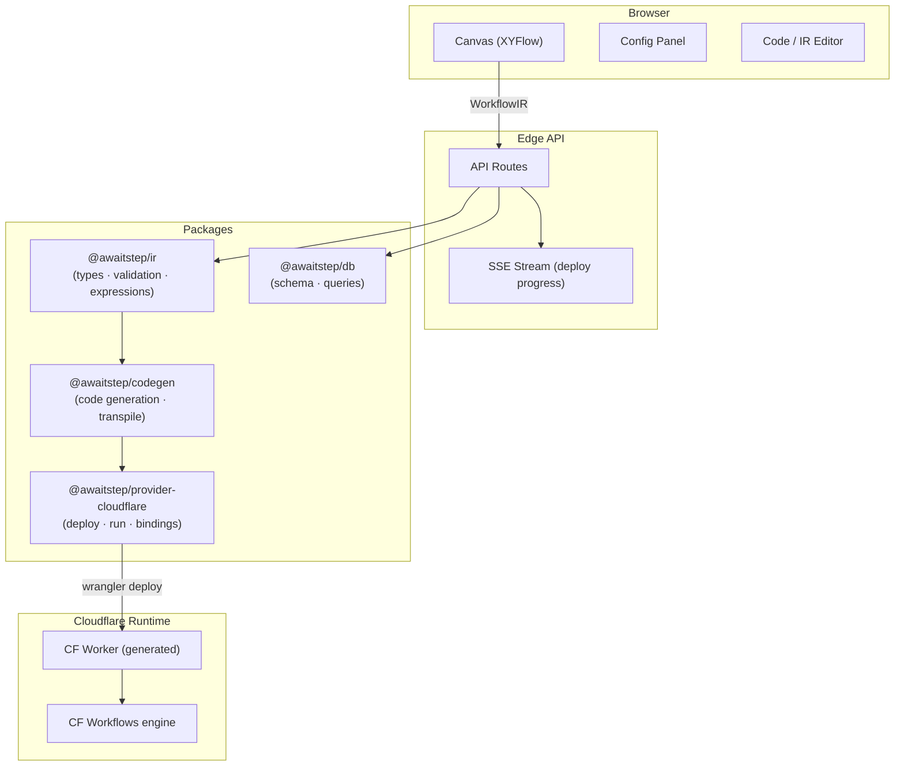
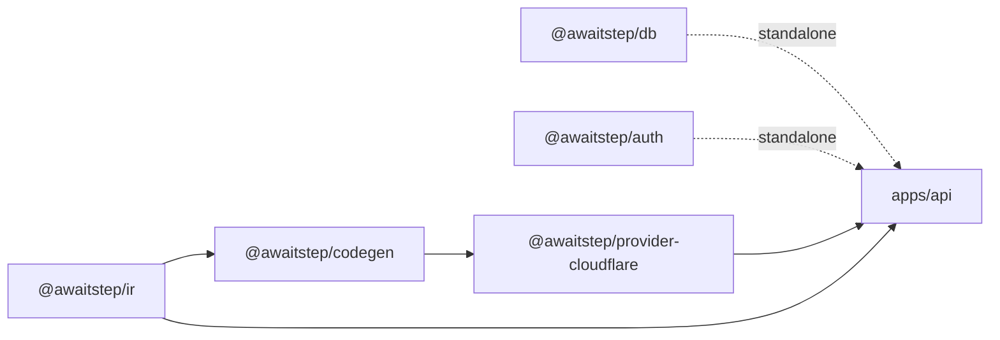

# Architecture

AwaitStep is a visual workflow builder that compiles a canvas into durable Cloudflare Workflows. The system is divided into four layers: a browser-based frontend, an edge API, a set of shared packages, and the runtime that executes deployed workflows.

## System Overview

## Package Dependency Flow

Packages follow a strict one-way dependency graph. No circular dependencies are permitted.

- `@awaitstep/ir` — Core IR types, Zod schemas, expression parser, IR validation, node registry, and all 12 built-in node definitions.
- `@awaitstep/codegen` — `CodeGenerator` interface, `WorkflowProvider` interface, DAG traversal, variable name sanitization, TypeScript transpilation.
- `@awaitstep/provider-cloudflare` — Concrete `WorkflowProvider` implementation for Cloudflare. Handles code generation, binding detection, wrangler-based deploy, run management, and local dev.
- `@awaitstep/db` — Drizzle ORM schema and query helpers. Standalone; no dependency on IR or codegen.
- `@awaitstep/auth` — Authentication utilities. Standalone.

## Provider Model

The `WorkflowProvider` interface in `@awaitstep/codegen` abstracts over execution backends. A provider must implement:

| Method                                  | Purpose                                                |
| --------------------------------------- | ------------------------------------------------------ |
| `validate(ir)`                          | Validate the IR against provider-specific constraints  |
| `generate(ir, config)`                  | Produce a `GeneratedArtifact` (source + compiled code) |
| `deploy(artifact, config)`              | Deploy the artifact to the target platform             |
| `trigger(deploymentId, params, config)` | Start a new workflow run                               |
| `getStatus(instanceId, config)`         | Poll the status of a run                               |
| `destroy(deploymentId, config)`         | Delete a deployed workflow                             |

Adding a new provider (e.g., Inngest, Temporal) only requires a new `packages/provider-*` package that implements this interface.

## Data Flow

1. The user builds a workflow on the canvas. Every change is serialized to a `WorkflowIR` object and saved via the API.
2. On deploy, the API passes the IR to `@awaitstep/ir` for validation, then to the provider's `generate()` method to produce TypeScript source.
3. The provider transpiles the TypeScript to JavaScript, detects required Cloudflare bindings, writes a `wrangler.json`, and runs `wrangler deploy` in a temp directory.
4. Deploy progress is streamed back to the browser via Server-Sent Events (SSE).
5. At runtime, Cloudflare Workflows executes the generated worker. Each node in the IR becomes a `step.do()` call, providing automatic retries and durable state.

## Key Design Decisions

**IR as the source of truth.** Generated code is never stored in the database. The IR is the only persistent representation of a workflow. Code is regenerated on every deploy.

**Provider isolation.** All Cloudflare-specific logic lives in `@awaitstep/provider-cloudflare`. API routes call `WorkflowProvider` methods — they never import from the provider package directly.

**Web-API-only templates.** Custom node templates for Cloudflare must use Web APIs only (`fetch`, `crypto`, `URL`, etc.). No Node.js APIs. This ensures templates run correctly in V8 isolates.

**Throw on errors.** Node templates must throw on failure. The platform wraps every node in `step.do()`, which handles retries automatically when an error is thrown.
