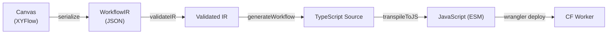

# Compilation

The compilation pipeline transforms an `ArtifactIR` (`WorkflowIR | ScriptIR`) into a deployable Cloudflare Worker. The pipeline dispatches on `ir.kind`: workflows compile to a `WorkflowEntrypoint` class with `step.do()` wrappers; scripts compile to a fetch handler that calls a generated `runGraph(env, event)` function. Stages 1–5 below are the same for both; only the final wrapper differs.

## Pipeline Overview



## Stage 1 — Build IR

The canvas serializes its node and edge state into a `WorkflowIR` object. This strips all UI-specific data (node selection state, viewport position, etc.) and keeps only execution-relevant fields: node IDs, types, config values, edge connections, and trigger config.

The IR is saved to the database on every canvas change. The most recent IR is what gets compiled on deploy.

## Stage 2 — Validate

Before any code is generated, the IR is passed through `validateIR` from `@awaitstep/ir`. This performs:

- **Schema validation** — all required fields present, all types correct (via Zod schemas)
- **Graph validation** — entry node exists, all edges reference valid node IDs, no orphaned nodes
- **Expression validation** — all <code v-pre>{{nodeId.property}}</code> expressions reference existing upstream nodes
- **Config validation** — required config fields are present for each node

```typescript
import { validateIR } from '@awaitstep/ir'

const result = validateIR(ir)
if (!result.ok) {
  // result.errors: ValidationError[]
  // Each error has: path, message, nodeId?
}
```

If validation fails, the pipeline stops and returns the errors to the UI. Deploy is blocked until all errors are resolved.

## Stage 3 — Generate Code

The validated IR is passed to either `generateWorkflow` or `generateScript` (in `@awaitstep/provider-cloudflare`) based on `ir.kind`. Both perform a topological sort of the node DAG, then emit TypeScript for each node in execution order using the same per-node generators in mode-aware form.

In **workflow mode**, each node is wrapped in a `step.do()` call, which gives it:

- Durable execution (automatic replay on worker restart)
- Configurable retry logic
- Persistent output storage

In **script mode**, the same per-node code is emitted without the `step.do()` wrapper — there is no step runner in a fetch handler. Step bodies are inlined raw into the generated `runGraph(env, event)` function. There are no retries, no durable replay; an unhandled error becomes a 500 response unless caught by user `triggerCode`.

### Variable Naming

Node IDs from the IR are sanitized into valid JavaScript identifiers. Each node's output is stored in a variable named `${sanitizedId}_result`.

```typescript
// IR node id: "fetch-user" → variable: "fetch_user_result"
const fetch_user_result = await step.do('fetch_user', async () => {
  // ...
})
```

### Example: http_request Node

IR:

```json
{
  "id": "fetch_user",
  "type": "http_request",
  "data": {
    "method": "GET",
    "url": "https://api.example.com/users/123",
    "retryLimit": 3
  }
}
```

Generated TypeScript:

```typescript
const fetch_user_result = await step.do(
  'fetch_user',
  {
    retries: { limit: 3, delay: '5 seconds', backoff: 'exponential' },
  },
  async () => {
    const response = await fetch('https://api.example.com/users/123', {
      method: 'GET',
    })
    if (!response.ok) {
      throw new Error(`HTTP ${response.status}: ${await response.text()}`)
    }
    return {
      status: response.status,
      body: await response.text(),
      headers: Object.fromEntries(response.headers.entries()),
    }
  },
)
```

### Example: branch Node

IR edge labels carry the condition expressions:

```json
{
  "edges": [
    {
      "id": "e1",
      "source": "check",
      "target": "success_path",
      "label": "fetch_user_result.status === 200"
    },
    {
      "id": "e2",
      "source": "check",
      "target": "error_path",
      "label": "fetch_user_result.status !== 200"
    }
  ]
}
```

Generated TypeScript:

```typescript
if (fetch_user_result.status === 200) {
  // success_path nodes...
} else if (fetch_user_result.status !== 200) {
  // error_path nodes...
}
```

### Expression Resolution

During code generation, <code v-pre>{{nodeId.property}}</code> expressions in config values are resolved to direct JavaScript property accesses:

```typescript
// Config value: "{{fetch_user_result.body}}"
// Resolved to:  fetch_user_result.body
```

## Stage 4 — Transpile

The generated TypeScript is passed to `transpileToJS` in `@awaitstep/codegen`. This uses the TypeScript compiler API to emit JavaScript (ESM) without type information.

```typescript
import { transpileToJS } from '@awaitstep/codegen/transpile'

const js = await transpileToJS(tsSource)
```

The output is a single `.js` file that Cloudflare Workers can execute directly.

## Stage 5 — Deploy

The compiled JavaScript and a generated `wrangler.json` are written to a temporary directory. If the workflow has npm dependencies (from custom nodes), a `package.json` is written and `npm install` is run first.

Then `wrangler deploy` is called to push the worker to Cloudflare. Deploy progress is reported via the `DeployStage` enum.

See [Deploy Pipeline](./deploy-pipeline.md) for the full stage breakdown.

## Full Generated Worker Shape

The output of the pipeline is a complete Cloudflare Worker module. The shape depends on `ir.kind`.

### Workflow shape

```typescript
import { WorkflowEntrypoint, WorkflowEvent, WorkflowStep } from 'cloudflare:workers'

interface Env {
  WORKFLOW: Workflow
  // ...other detected bindings
}

export class MyWorkflow extends WorkflowEntrypoint<Env> {
  async run(event: WorkflowEvent<unknown>, step: WorkflowStep) {
    // Step 1
    const fetch_user_result = await step.do('fetch_user', async () => {
      // ...
    })

    // Step 2 — conditional
    if (fetch_user_result.status === 200) {
      const send_email_result = await step.do('send_email', async () => {
        // ...
      })
    }
  }
}

export default {
  async fetch(request: Request, env: Env): Promise<Response> {
    // HTTP trigger handler (if configured) creates a new instance.
    const instance = await env.WORKFLOW.create()
    return new Response(JSON.stringify({ instanceId: instance.id }))
  },
}
```

### Script shape (kind: 'script')

```typescript
interface Env {
  // No WORKFLOW self-binding — scripts are not a Workflow.
  // Sub-workflow bindings + detected resource bindings only.
}

async function runGraph(env: Env, event: { payload: unknown }) {
  // Per-node generated code — no step.do() wraps, raw inline.
  const fetch_user = await fetch('https://api.example.com/users/123')

  // Only EXPORT_-prefixed nodes surface on the returned graph object.
  return { fetch_user }
}

export default {
  async fetch(request: Request, env: Env): Promise<Response> {
    try {
      if (request.method !== 'POST') {
        return new Response(null, { status: 200 })
      }
      const params = await request.json().catch(() => undefined)
      const event = { payload: params }

      const graph = await runGraph(env, event)

      return Response.json(graph)
    } catch (error) {
      return Response.json({ message: error.message }, { status: 500 })
    }
  },
}
```

### `EXPORT_` prefix — opt-in graph outputs

By default, `runGraph` returns an empty object — node outputs are internal to the graph. To expose a node's value on `graph.X`, prefix the node's display name with `EXPORT_`:

| Node display name   | Surfaces on graph as                                                             |
| ------------------- | -------------------------------------------------------------------------------- |
| `Fetch User`        | (not exported — present in graph internals only)                                 |
| `EXPORT_FetchUser`  | `graph.FetchUser` (prefix stripped from the variable name)                       |
| `EXPORT_DirectMail` | `graph.DirectMail` (works inside containers — value is hoisted out of the block) |

A node without `EXPORT_` that isn't referenced by any downstream node is dropped entirely (its `await` becomes a bare statement) — keeps the generated code lean.

### Trigger code customization

Both shapes use a default fetch handler body that the user can override via the workflow's `triggerCode` field. For workflows, the default creates a new instance per POST. For scripts, the default JSONs the `graph` object. Custom `triggerCode` is emitted verbatim inside `async fetch(request, env)`; the generated class (workflows) or `runGraph` function (scripts) stay stable across edits.
