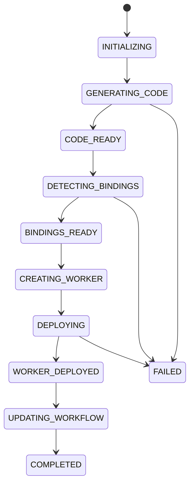

# Deploy Pipeline

Clicking **Deploy** in the AwaitStep UI starts a multi-stage pipeline. Each stage is reported in real time via a Server-Sent Events (SSE) stream, which the UI uses to render the progress indicator.


## Deploy Stages



| Stage                | Progress | What Happens                                                                                                                                                                                |
| -------------------- | -------- | ------------------------------------------------------------------------------------------------------------------------------------------------------------------------------------------- |
| `INITIALIZING`       | 5%       | Credentials are validated, workflow IR is fetched from the database.                                                                                                                        |
| `GENERATING_CODE`    | 15%      | The IR is passed to the codegen pipeline. TypeScript source is generated and then transpiled to JavaScript via the TypeScript compiler API.                                                 |
| `CODE_READY`         | 25%      | Compiled JavaScript is ready.                                                                                                                                                               |
| `DETECTING_BINDINGS` | 35%      | The IR is scanned for required Cloudflare resource bindings (KV namespaces, D1 databases, R2 buckets, sub-workflow bindings). Missing binding IDs cause the pipeline to fail at this stage. |
| `BINDINGS_READY`     | 45%      | All required bindings are resolved.                                                                                                                                                         |
| `CREATING_WORKER`    | 55%      | A temporary deploy directory is created. `worker.js` and `wrangler.json` are written. If the workflow has npm dependencies, `package.json` is written and `npm install` is run.             |
| `DEPLOYING`          | 65%      | `wrangler deploy` is called. This uploads the worker to Cloudflare. After deploy, secrets are uploaded via `wrangler secret put`.                                                           |
| `WORKER_DEPLOYED`    | 80%      | The Cloudflare Worker is live.                                                                                                                                                              |
| `UPDATING_WORKFLOW`  | 90%      | The deployment record in the AwaitStep database is updated with the new worker name, URL, and deployment timestamp.                                                                         |
| `COMPLETED`          | 100%     | Deploy finished. The workflow URL is returned.                                                                                                                                              |
| `FAILED`             | —        | Any stage can fail. The error message from that stage is reported. The deploy is rolled back automatically (temp files cleaned up).                                                         |

## Automatic Binding Detection

AwaitStep automatically detects which Cloudflare resources your workflow needs:

- **KV namespaces** — any `step` node code that references `env.MY_KV` will add a KV binding named `MY_KV`.
- **D1 databases** — references to `env.MY_DB` add a D1 binding.
- **R2 buckets** — references to `env.MY_BUCKET` add an R2 binding.
- **Sub-workflow bindings** — every `sub_workflow` node adds a Workflow binding for the child workflow.

For KV and D1 bindings, AwaitStep needs the resource ID to generate the `wrangler.json`. You must provide these via environment variables in the **Environment** panel:

```
MY_KV_BINDING_ID=<your-kv-namespace-id>
MY_DB_BINDING_ID=<your-d1-database-id>
```

If a required binding ID is missing, the deploy will fail at the `DETECTING_BINDINGS` stage with a clear error message.

## SSE Stream

The deploy endpoint streams progress using Server-Sent Events. Each event is a JSON object matching the `DeployProgress` type:

```typescript
interface DeployProgress {
  stage: DeployStage
  message: string
  progress: number // 0–100
}
```

Example SSE stream:

```
data: {"stage":"INITIALIZING","message":"Preparing deployment...","progress":5}

data: {"stage":"GENERATING_CODE","message":"Transpiling TypeScript...","progress":15}

data: {"stage":"CODE_READY","message":"Code compiled","progress":25}

data: {"stage":"DETECTING_BINDINGS","message":"Analyzing workflow bindings...","progress":35}

data: {"stage":"BINDINGS_READY","message":"Bindings configured","progress":45}

data: {"stage":"CREATING_WORKER","message":"Creating Cloudflare Worker...","progress":55}

data: {"stage":"DEPLOYING","message":"Deploying to Cloudflare...","progress":65}

data: {"stage":"WORKER_DEPLOYED","message":"Worker deployed","progress":80}

data: {"stage":"UPDATING_WORKFLOW","message":"Updating workflow configuration...","progress":90}

data: {"stage":"COMPLETED","message":"Deployment successful","progress":100}
```

## What Gets Deployed

The deploy produces a single Cloudflare Worker:

- **Worker name** — derived from the workflow ID: `awaitstep-<workflowId>`
- **Worker URL** — `https://awaitstep-<workflowId>.<accountSubdomain>.workers.dev`
- **Dashboard URL** — link to the Cloudflare dashboard for the deployed worker

The worker exports a `WorkflowEntrypoint` class and, if an HTTP trigger is configured, a `fetch` handler.

## Re-deploying

Every deploy is a full replacement. The existing worker is overwritten by `wrangler deploy`. Secrets that were previously set and are not present in the new deploy are not automatically removed — they persist in the Cloudflare secret store.

## Deploy Failures

If the deploy fails, the error is shown in the UI with the stage that failed. Common failure causes:

- **Invalid credentials** — `accountId` or `apiToken` is wrong or expired.
- **Missing binding ID** — a KV or D1 binding ID environment variable is not set.
- **Compile error** — the generated TypeScript has a type error (rare; usually caused by malformed expressions).
- **Wrangler timeout** — the deploy took longer than 2 minutes (network or Cloudflare API issue).
