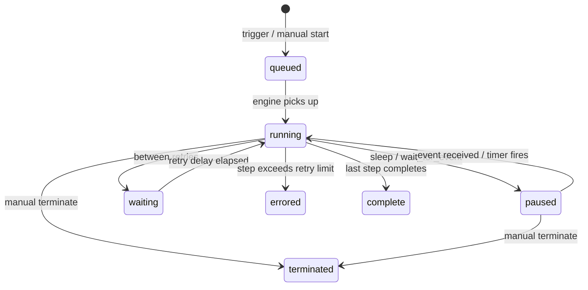

# Run Lifecycle

A run is a single execution instance of a deployed workflow. Each run has its own instance ID, status, and output.

## Run Statuses

| Status       | Description                                                                                                                                                             |
| ------------ | ----------------------------------------------------------------------------------------------------------------------------------------------------------------------- |
| `queued`     | The run has been created but the Cloudflare Workflows engine has not started it yet.                                                                                    |
| `running`    | Steps are actively executing.                                                                                                                                           |
| `paused`     | Execution is paused at a `wait_for_event` or `sleep` node. The workflow is durably suspended and will resume automatically when the event arrives or the sleep expires. |
| `waiting`    | The workflow is waiting on an internal Cloudflare condition (e.g. between retries).                                                                                     |
| `errored`    | A step threw an error that exceeded the retry limit, or an unhandled exception occurred.                                                                                |
| `terminated` | The run was manually terminated.                                                                                                                                        |
| `complete`   | The workflow ran to completion successfully.                                                                                                                            |

## Status Transitions



## Creating a Run

Runs are created by triggering the deployed workflow. There are three ways:

**1. From the AwaitStep UI**

Click **Run** on the workflow detail page. You can optionally provide a JSON input payload. The UI displays the new run's status in real time.

**2. Via the AwaitStep API**

```http
POST /api/v1/workflows/:workflowId/runs
Content-Type: application/json

{
  "input": { "userId": "usr_abc123" }
}
```

Response:

```json
{
  "instanceId": "01JXXX...",
  "status": "queued"
}
```

**3. Via a trigger**

If the workflow has an HTTP trigger configured, Cloudflare will start a run for each incoming request. The request body is passed as the workflow input.

## Polling Run Status

Poll the status of a run via the API:

```http
GET /api/v1/workflows/:workflowId/runs/:instanceId
```

Response:

```json
{
  "instanceId": "01JXXX...",
  "status": "complete",
  "output": { "chargeId": "ch_abc123", "success": true },
  "error": null
}
```

The `output` field contains the return value of the last step in the workflow. The `error` field contains the error message if the run errored.

:::tip
The Cloudflare Workflows engine is the system of record for run status. AwaitStep proxies status requests directly to the Cloudflare API — there is no intermediate polling cache.
:::

## Paused Runs

A run is paused when it reaches a `sleep`, `sleep_until`, or `wait_for_event` node. Paused runs do not consume CPU or memory. The Cloudflare Workflows engine durably persists the run's state and resumes it automatically:

- **sleep** — resumes after the specified duration
- **sleep_until** — resumes at the specified timestamp
- **wait_for_event** — resumes when an event is sent

### Sending an Event to Resume a Run

```http
POST /api/v1/workflows/:workflowId/runs/:instanceId/events
Content-Type: application/json

{
  "eventType": "user-approval",
  "payload": { "approved": true, "approvedBy": "alice@example.com" }
}
```

The payload is available in the workflow as `wait_node_result.payload`.

If a `wait_for_event` node has a `timeout` configured and the timeout expires before an event arrives, the workflow throws a timeout error and transitions to `errored`.

## Terminating a Run

A run can be manually terminated from the UI or via the API:

```http
DELETE /api/v1/workflows/:workflowId/runs/:instanceId
```

Terminating a run that is `running` or `paused` sends a cancellation signal to the Cloudflare Workflows engine. The run transitions to `terminated`. Terminated runs cannot be resumed.

## Run Output and Errors

Once a run is in a terminal state (`complete`, `errored`, or `terminated`), its output or error message is available in the run detail view and via the API.


- **complete** — `output` contains the serialized return value of the last step.
- **errored** — `error` contains the error message from the step that failed.
- **terminated** — both `output` and `error` are null.

:::info
Step outputs are persisted by the Cloudflare Workflows engine in durable storage. They survive worker restarts and are available even after the run completes.
:::

## Cloudflare Limits Affecting Runs

| Limit                         | Value                           |
| ----------------------------- | ------------------------------- |
| Concurrent workflow instances | 1,000 per account               |
| Max workflow duration         | 1 year                          |
| Max step CPU time             | 15 minutes per step             |
| Max step wall time            | 30 seconds per `step.do()` call |
| Max steps per workflow        | 100                             |
| Max event payload size        | 1 MB                            |

See [Cloudflare Limits](./cloudflare-limits.md) for details and workarounds.
