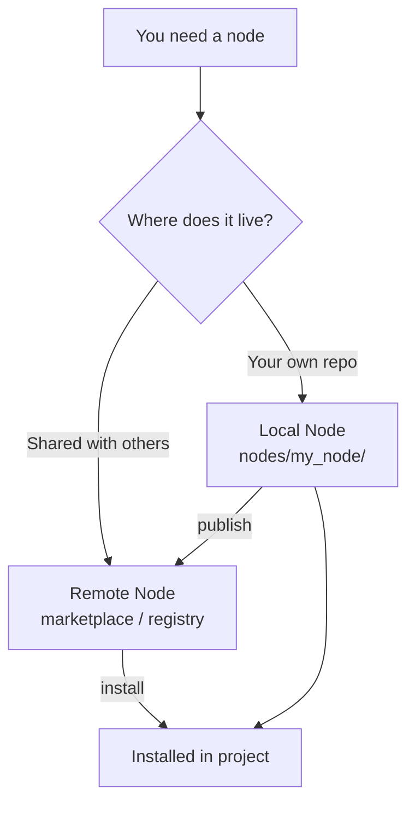

# Custom Nodes

Custom nodes let you extend AwaitStep with any integration or business logic. They are indistinguishable from built-in nodes once installed — they appear in the node picker, render a config form automatically, and produce typed outputs that downstream nodes can reference.

## Local vs Remote Nodes



**Local nodes** live in your repository under `nodes/<node_id>/`. They are available immediately with no install step. Use local nodes for business-specific integrations, internal APIs, and one-off transforms.

**Remote nodes** are fetched from a registry (the AwaitStep marketplace or a private registry). They are installed into your project and pinned to a specific version. Use remote nodes for reusable integrations you want to share across projects or with the community.

## Directory Structure

Every node lives in its own directory under `nodes/`. The directory name is the node ID.

```
nodes/
└── stripe_charge/
    ├── node.json              ← Required. NodeDefinition schema.
    ├── README.md              ← Required. Human-readable docs.
    ├── templates/
    │   ├── cloudflare.ts      ← Required (at least one template).
    │   ├── inngest.ts         ← Optional.
    │   └── temporal.ts        ← Optional.
    └── tests/
        ├── cloudflare.test.ts ← Required if cloudflare template exists.
        └── fixtures/
            └── config.json
```

## node.json Schema

```json
{
  "id": "stripe_charge",
  "name": "Stripe Charge",
  "version": "1.0.0",
  "description": "Charge a customer using Stripe.",
  "category": "Payments",
  "tags": ["payments", "stripe"],
  "author": "your-github-username",
  "license": "MIT",

  "configSchema": {
    "amount": {
      "type": "number",
      "label": "Amount (cents)",
      "required": true,
      "validation": { "min": 50, "max": 9999999 }
    },
    "currency": {
      "type": "select",
      "label": "Currency",
      "required": true,
      "default": "usd",
      "options": ["usd", "eur", "gbp"]
    },
    "customerId": {
      "type": "expression",
      "label": "Customer ID",
      "required": true,
      "placeholder": "&#123;&#123;fetch_customer.id&#125;&#125;"
    },
    "apiKey": {
      "type": "secret",
      "label": "Stripe Secret Key",
      "required": true,
      "envVarName": "STRIPE_SECRET_KEY",
      "description": "Found in your Stripe Dashboard under Developers → API keys."
    }
  },

  "outputSchema": {
    "chargeId": {
      "type": "string",
      "description": "Stripe charge ID (ch_...)"
    },
    "success": {
      "type": "boolean",
      "description": "Whether the charge was captured"
    },
    "amount": {
      "type": "number",
      "description": "Amount charged in cents"
    }
  },

  "providers": ["cloudflare"]
}
```

## Node ID Rules

- Pattern: `^[a-z][a-z0-9_]*$` — lowercase letters, numbers, underscores only
- Must start with a letter
- Cannot conflict with built-in IDs: `step`, `sleep`, `sleep_until`, `branch`, `parallel`, `http_request`, `wait_for_event`, `loop`, `break`, `race`, `try_catch`, `sub_workflow`

## Config Schema Field Types

| Type          | UI Control                   | When to Use           | Extra Required |
| ------------- | ---------------------------- | --------------------- | -------------- |
| `string`      | Text input                   | Names, IDs, URLs      | —              |
| `number`      | Numeric input                | Amounts, counts       | —              |
| `boolean`     | Toggle                       | On/off flags          | —              |
| `select`      | Dropdown                     | Fixed list of choices | `options[]`    |
| `multiselect` | Multi-select                 | Multiple choices      | `options[]`    |
| `secret`      | Masked input                 | API keys, tokens      | `envVarName`   |
| `code`        | Monaco (TypeScript)          | Custom logic          | —              |
| `json`        | Monaco (JSON)                | Structured data       | —              |
| `expression`  | Expression with autocomplete | Upstream step outputs | —              |
| `textarea`    | Multi-line text              | Long text, templates  | —              |

:::warning
Every `secret` field must declare `envVarName`. Every `select`/`multiselect` field must declare a non-empty `options` array. The node validator will reject definitions that violate these rules.
:::

## Template Structure

```typescript
import type { NodeContext } from '@awaitstep/node-sdk'

// Config mirrors configSchema, with secret fields typed as `never`
interface Config {
  amount: number
  currency: string
  customerId: string
  apiKey: never // accessed via ctx.env, not ctx.config
}

interface Output {
  chargeId: string
  success: boolean
  amount: number
}

export default async function (ctx: NodeContext<Config>): Promise<Output> {
  const response = await fetch('https://api.stripe.com/v1/charges', {
    method: 'POST',
    headers: {
      Authorization: `Bearer ${ctx.env.STRIPE_SECRET_KEY}`,
      'Content-Type': 'application/x-www-form-urlencoded',
    },
    body: new URLSearchParams({
      amount: String(ctx.config.amount),
      currency: ctx.config.currency,
      customer: ctx.config.customerId,
    }),
  })

  if (!response.ok) {
    const err = await response.text()
    throw new Error(`Stripe error (${response.status}): ${err}`)
  }

  const charge = (await response.json()) as { id: string; captured: boolean; amount: number }

  return {
    chargeId: charge.id,
    success: charge.captured,
    amount: charge.amount,
  }
}
```

### Template Rules

1. Export a default async function. No named exports.
2. Return an object matching `outputSchema` exactly — no missing or extra fields.
3. **Throw on errors** — never return `{ success: false }`. The platform retries on throw.
4. **Cloudflare templates: Web APIs only** — no `fs`, `path`, `process`, `Buffer`. Use `fetch`, `crypto`, `URL`, `TextEncoder`, etc.
5. **Never call durable primitives** — no `step.do()`, `step.sleep()`, `step.sleepUntil()`, `step.waitForEvent()`. The platform wraps your code.
6. **Access secrets via `ctx.env`** — never via `ctx.config`.
7. Never log secret values.

## Output Schema

The `outputSchema` types the node's return value. Downstream nodes can reference fields via `<span v-pre>&#123;&#123;nodeId.fieldName&#125;&#125;</span>`.

```json
{
  "user": {
    "type": "object",
    "description": "Created user record",
    "properties": {
      "id": { "type": "string" },
      "email": { "type": "string" },
      "createdAt": { "type": "string" }
    }
  },
  "results": {
    "type": "array",
    "items": {
      "type": "object",
      "properties": {
        "id": { "type": "string" },
        "score": { "type": "number" }
      }
    }
  }
}
```

- `object` fields must have `properties`
- `array` fields must have `items`

## Testing

Every template must have a test file in `tests/`. Tests use vitest and `createMockContext` from `@awaitstep/node-sdk/testing`.

```typescript
import { describe, it, expect, vi, beforeEach } from 'vitest'
import { createMockContext } from '@awaitstep/node-sdk/testing'
import handler from '../templates/cloudflare'

describe('stripe_charge / cloudflare', () => {
  beforeEach(() => {
    vi.restoreAllMocks()
  })

  it('returns charge data on success', async () => {
    global.fetch = vi.fn().mockResolvedValue({
      ok: true,
      json: async () => ({ id: 'ch_abc123', captured: true, amount: 1000 }),
    })
    const ctx = createMockContext({
      config: { amount: 1000, currency: 'usd', customerId: 'cus_xyz' },
      env: { STRIPE_SECRET_KEY: 'sk_test_fake' },
    })
    const result = await handler(ctx)
    expect(result).toEqual({ chargeId: 'ch_abc123', success: true, amount: 1000 })
  })

  it('throws on Stripe API error', async () => {
    global.fetch = vi.fn().mockResolvedValue({
      ok: false,
      status: 402,
      text: async () => 'card_declined',
    })
    const ctx = createMockContext({
      config: { amount: 1000, currency: 'usd', customerId: 'cus_xyz' },
      env: { STRIPE_SECRET_KEY: 'sk_test_fake' },
    })
    await expect(handler(ctx)).rejects.toThrow()
  })
})
```

Required test cases per template:

1. Happy path — successful API response, verify output matches schema
2. Error path — failed response, verify the template throws
3. Auth verification — verify the correct authorization header is sent

## Authoring Checklist

### node.json

- [ ] `id` matches directory name
- [ ] `id` matches `^[a-z][a-z0-9_]*$`
- [ ] `id` does not conflict with built-in IDs
- [ ] `version` is valid semver
- [ ] `description` is under 120 characters
- [ ] `category` is a valid Category
- [ ] `author` and `license` are present
- [ ] All `secret` fields have `envVarName`
- [ ] All `select`/`multiselect` fields have non-empty `options`

### Templates

- [ ] At least one template file exists
- [ ] Each provider in `providers` has a matching template file
- [ ] Default async function export
- [ ] No `step.do` / `step.sleep` / `step.sleepUntil` / `step.waitForEvent` calls
- [ ] Errors thrown, not swallowed
- [ ] Secrets via `ctx.env`
- [ ] No secret logging

### Tests

- [ ] One test file per template
- [ ] Happy + error path tests present
- [ ] `fetch` is mocked
- [ ] Uses `createMockContext`

### README

- [ ] File exists and is non-empty
- [ ] Config field table
- [ ] Output field table
