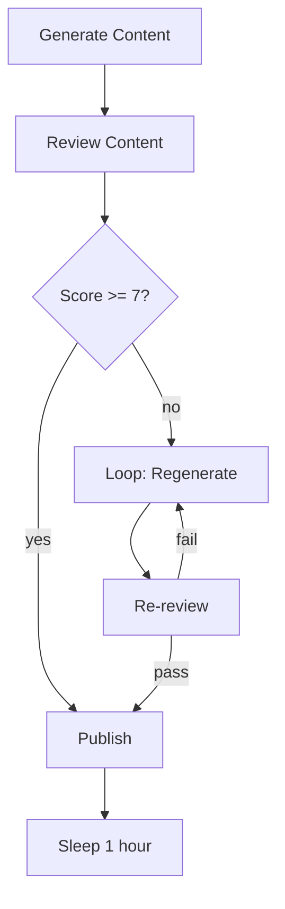

# AI Agent Loop

Generates content with an AI model, evaluates the output against a quality gate, and retries with a refined prompt if the quality threshold is not met.

## Workflow structure



## Nodes

| #   | Node name        | Type            | Purpose                                         |
| --- | ---------------- | --------------- | ----------------------------------------------- |
| 1   | Parse Request    | Step            | Extract topic and requirements from the trigger |
| 2   | Generation Loop  | Loop (times: 3) | Retry generation up to 3 times                  |
| 3   | Generate Content | HTTP Request    | Call OpenAI Chat Completions                    |
| 4   | Evaluate Quality | Step            | Score the generated content                     |
| 5   | Quality Gate     | Branch          | Pass if score ≥ 80, else continue loop          |
| 6   | Break            | Break           | Exit loop early on success                      |
| 7   | Save Result      | HTTP Request    | POST the accepted content to your API           |

## Trigger

API trigger.

```bash
curl -X POST https://app.awaitstep.dev/api/workflows/<id>/trigger \
  -H "Authorization: Bearer ask_yourkey" \
  -H "Content-Type: application/json" \
  -d '{
    "connectionId": "<conn-id>",
    "params": {
      "topic": "Benefits of serverless workflows",
      "tone": "professional",
      "wordCount": 200
    }
  }'
```

## Generated TypeScript

```typescript
import { WorkflowEntrypoint, WorkflowEvent, WorkflowStep } from 'cloudflare:workers'

export class AiAgentWorkflow extends WorkflowEntrypoint<Env, Params> {
  async run(event: WorkflowEvent<Params>, step: WorkflowStep) {
    const parse_request = await step.do('Parse Request', async () => {
      const { topic, tone, wordCount } = event.payload ?? {}
      if (!topic) throw new Error('topic is required')
      return {
        topic: String(topic),
        tone: String(tone ?? 'professional'),
        wordCount: Number(wordCount ?? 200),
      }
    })

    const generation_loop = await step.do('Generation Loop', async () => {
      let _output
      for (let _loop_i = 0; _loop_i < 3; _loop_i++) {
        const generate_content = await step.do(`Generate Content [${_loop_i}]`, async () => {
          const prompt =
            _loop_i === 0
              ? `Write a ${parse_request.wordCount}-word ${parse_request.tone} article about: ${parse_request.topic}`
              : `Rewrite the following article about "${parse_request.topic}" to improve clarity and engagement. Keep it ${parse_request.wordCount} words.`

          const res = await fetch('https://api.openai.com/v1/chat/completions', {
            method: 'POST',
            headers: {
              Authorization: `Bearer ${env.OPENAI_API_KEY}`,
              'Content-Type': 'application/json',
            },
            body: JSON.stringify({
              model: 'gpt-4o-mini',
              messages: [{ role: 'user', content: prompt }],
              max_tokens: 500,
            }),
          })
          if (!res.ok) throw new Error(`OpenAI error: ${res.status}`)
          const data = await res.json()
          return { content: data.choices[0]?.message?.content ?? '' }
        })

        const evaluate_quality = await step.do(`Evaluate Quality [${_loop_i}]`, async () => {
          const wordCount = generate_content.content.split(/\s+/).length
          const hasIntro = generate_content.content.length > 100
          const meetsLength =
            Math.abs(wordCount - parse_request.wordCount) <= parse_request.wordCount * 0.2
          const score = (hasIntro ? 50 : 0) + (meetsLength ? 50 : 20)
          return { score, wordCount }
        })

        if (evaluate_quality.score >= 80) {
          _output = {
            content: generate_content.content,
            score: evaluate_quality.score,
            attempts: _loop_i + 1,
          }
          break
        }
      }
      return _output
    })

    await step.do('Save Result', async () => {
      const res = await fetch(`${env.API_BASE_URL}/content`, {
        method: 'POST',
        headers: { 'Content-Type': 'application/json' },
        body: JSON.stringify({
          topic: parse_request.topic,
          content: generation_loop?.content,
          score: generation_loop?.score,
          attempts: generation_loop?.attempts,
        }),
      })
      if (!res.ok) throw new Error(`API error: ${res.status}`)
    })
  }
}
```

## Required env vars

| Variable         | Description                  |
| ---------------- | ---------------------------- |
| `OPENAI_API_KEY` | OpenAI API key               |
| `API_BASE_URL`   | Base URL of your backend API |

## Customising the quality gate

The example uses a simple word-count and length heuristic. Replace the **Evaluate Quality** step with a call to a second AI model (e.g. an OpenAI moderation or scoring prompt) for production use cases.

## Extending the loop

- Increase the loop count to allow more retries.
- Add a Sleep node inside the loop body to introduce a delay between attempts.
- Persist each attempt's content to a database so you can review all generated versions.
