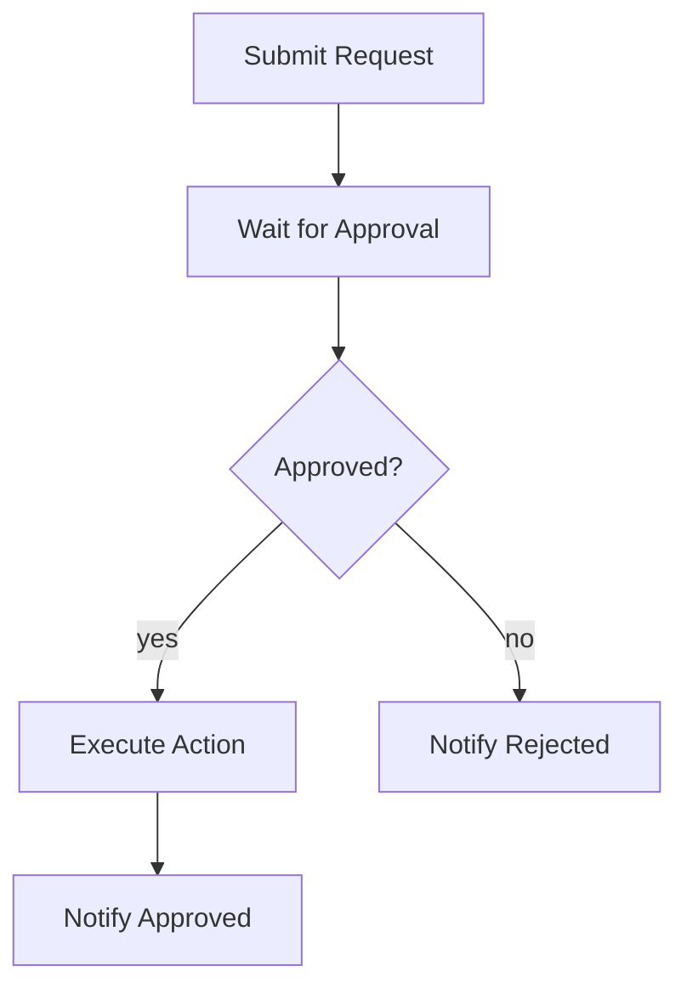

# Human Approval

Pauses a workflow at a decision point and waits for a human to approve or reject before continuing. The workflow can wait for days or weeks with no compute cost.

## Workflow structure



## Nodes

| #   | Node name                   | Type               | Purpose                                          |
| --- | --------------------------- | ------------------ | ------------------------------------------------ |
| 1   | Create Request              | Step               | Prepare the approval request record              |
| 2   | Notify Reviewer             | Resend: Send Email | Email the reviewer with an approve/reject link   |
| 3   | Wait for Decision           | Wait for Event     | Pause until an `approval-decision` event arrives |
| 4   | Route Decision              | Branch             | Approve or reject path                           |
| 5   | Execute Approved Action     | Step               | Carry out the approved action (success path)     |
| 6   | Notify Requester — Rejected | Resend: Send Email | Tell the requester it was rejected (reject path) |

## Trigger

API trigger. Call from your application when an action requires approval.

```bash
curl -X POST https://app.awaitstep.dev/api/workflows/<id>/trigger \
  -H "Authorization: Bearer ask_yourkey" \
  -H "Content-Type: application/json" \
  -d '{
    "connectionId": "<conn-id>",
    "params": {
      "requestId": "req_001",
      "requesterEmail": "alice@example.com",
      "reviewerEmail": "manager@example.com",
      "action": "Approve $5,000 budget increase for Q3 marketing"
    }
  }'
```

## Sending the decision

When the reviewer clicks approve or reject, your backend sends an event to the waiting workflow instance:

```bash
curl -X POST https://app.awaitstep.dev/api/workflows/<id>/trigger \
  -H "Authorization: Bearer ask_yourkey" \
  -H "Content-Type: application/json" \
  -d '{
    "connectionId": "<conn-id>",
    "params": {
      "instanceId": "<run-id>",
      "eventType": "approval-decision",
      "payload": {
        "approved": true,
        "comments": "Approved — within Q3 budget allocation"
      }
    }
  }'
```

## Generated TypeScript

```typescript
import { WorkflowEntrypoint, WorkflowEvent, WorkflowStep } from 'cloudflare:workers'

export class HumanApprovalWorkflow extends WorkflowEntrypoint<Env, Params> {
  async run(event: WorkflowEvent<Params>, step: WorkflowStep) {
    const create_request = await step.do('Create Request', async () => {
      const { requestId, requesterEmail, reviewerEmail, action } = event.payload ?? {}
      if (!requestId || !reviewerEmail) throw new Error('Missing requestId or reviewerEmail')
      return { requestId, requesterEmail, reviewerEmail, action }
    })

    await step.do('Notify Reviewer', async () => {
      const approveUrl = `${env.APP_URL}/approvals/${create_request.requestId}?action=approve`
      const rejectUrl = `${env.APP_URL}/approvals/${create_request.requestId}?action=reject`

      const res = await fetch('https://api.resend.com/emails', {
        method: 'POST',
        headers: {
          Authorization: `Bearer ${env.RESEND_API_KEY}`,
          'Content-Type': 'application/json',
        },
        body: JSON.stringify({
          from: 'approvals@example.com',
          to: create_request.reviewerEmail,
          subject: `Approval required: ${create_request.action}`,
          html: `
            <p>A request requires your approval:</p>
            <blockquote>${create_request.action}</blockquote>
            <p>
              <a href="${approveUrl}">Approve</a> &nbsp;|&nbsp;
              <a href="${rejectUrl}">Reject</a>
            </p>
          `,
        }),
      })
      if (!res.ok) throw new Error(`Resend error: ${res.status}`)
    })

    // Pause here — the workflow sleeps durably until an event arrives.
    const wait_for_decision = await step.waitForEvent('Wait for Decision', {
      type: 'approval-decision',
      timeout: '72 hours',
    })

    if (wait_for_decision.approved === true) {
      await step.do('Execute Approved Action', async () => {
        // Carry out the approved action — update your database, trigger a payment, etc.
        const res = await fetch(
          `${env.API_BASE_URL}/requests/${create_request.requestId}/approve`,
          {
            method: 'POST',
            headers: { 'Content-Type': 'application/json' },
            body: JSON.stringify({ comments: wait_for_decision.comments }),
          },
        )
        if (!res.ok) throw new Error(`API error: ${res.status}`)
      })
    } else {
      await step.do('Notify Requester — Rejected', async () => {
        const res = await fetch('https://api.resend.com/emails', {
          method: 'POST',
          headers: {
            Authorization: `Bearer ${env.RESEND_API_KEY}`,
            'Content-Type': 'application/json',
          },
          body: JSON.stringify({
            from: 'approvals@example.com',
            to: create_request.requesterEmail,
            subject: `Request rejected: ${create_request.action}`,
            text: `Your request was rejected.\n\nComments: ${wait_for_decision.comments ?? 'None'}`,
          }),
        })
        if (!res.ok) throw new Error(`Resend error: ${res.status}`)
      })
    }
  }
}
```

## Required env vars

| Variable         | Description                                            |
| ---------------- | ------------------------------------------------------ |
| `RESEND_API_KEY` | Resend API key                                         |
| `APP_URL`        | Your application's base URL (for approve/reject links) |
| `API_BASE_URL`   | Base URL of your backend API                           |

## Handling timeout

If no decision arrives within 72 hours, `step.waitForEvent` throws. Wrap the Wait for Event node in a **Try/Catch** node to handle timeouts — for example, auto-rejecting and notifying the requester that the request expired.
