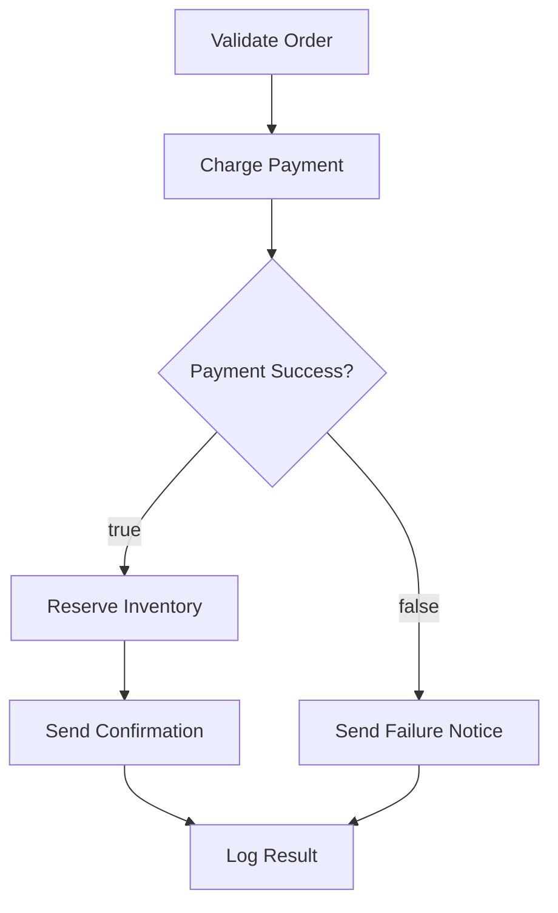

# Order Processing

A payment pipeline that charges a card, handles failures with a branch, sends a receipt on success, and notifies the team on failure.

## Workflow structure



## Nodes

| #   | Node name           | Type                  | Purpose                                          |
| --- | ------------------- | --------------------- | ------------------------------------------------ |
| 1   | Parse Order         | Step                  | Extract order fields from the trigger payload    |
| 2   | Charge Card         | Stripe: Create Charge | Attempt the payment                              |
| 3   | Payment Decision    | Branch                | Route based on charge success                    |
| 4   | Send Receipt        | Resend: Send Email    | Email the receipt to the customer (success path) |
| 5   | Notify Ops          | Slack: Post Message   | Alert the team of the failure (failure path)     |
| 6   | Update Order Status | HTTP Request          | PATCH the order record in your backend           |

## Trigger

API trigger. Send a POST request with the order details in the payload.

```bash
curl -X POST https://app.awaitstep.dev/api/workflows/<id>/trigger \
  -H "Authorization: Bearer ask_yourkey" \
  -H "Content-Type: application/json" \
  -d '{
    "connectionId": "<conn-id>",
    "params": {
      "orderId": "ord_001",
      "customerId": "cus_abc",
      "amount": 4999,
      "currency": "usd",
      "email": "customer@example.com"
    }
  }'
```

## Generated TypeScript

```typescript
import { WorkflowEntrypoint, WorkflowEvent, WorkflowStep } from 'cloudflare:workers'

export class OrderProcessingWorkflow extends WorkflowEntrypoint<Env, Params> {
  async run(event: WorkflowEvent<Params>, step: WorkflowStep) {
    const parse_order = await step.do('Parse Order', async () => {
      const { orderId, customerId, amount, currency, email } = event.payload ?? {}
      if (!orderId || !customerId || !amount) throw new Error('Missing required fields')
      return { orderId, customerId, amount, currency: currency ?? 'usd', email }
    })

    const charge_card = await step.do(
      'Charge Card',
      {
        retries: { limit: 3, delay: '5 seconds', backoff: 'exponential' },
      },
      async () => {
        const res = await fetch('https://api.stripe.com/v1/charges', {
          method: 'POST',
          headers: {
            Authorization: `Bearer ${env.STRIPE_SECRET_KEY}`,
            'Content-Type': 'application/x-www-form-urlencoded',
          },
          body: new URLSearchParams({
            amount: String(parse_order.amount),
            currency: parse_order.currency,
            customer: parse_order.customerId,
          }),
        })
        if (!res.ok) {
          const err = await res.json()
          throw new Error(`Stripe error: ${err.error?.message}`)
        }
        const charge = await res.json()
        return { chargeId: charge.id, success: charge.paid }
      },
    )

    if (charge_card.success) {
      await step.do('Send Receipt', async () => {
        const res = await fetch('https://api.resend.com/emails', {
          method: 'POST',
          headers: {
            Authorization: `Bearer ${env.RESEND_API_KEY}`,
            'Content-Type': 'application/json',
          },
          body: JSON.stringify({
            from: 'orders@example.com',
            to: parse_order.email,
            subject: `Receipt for order ${parse_order.orderId}`,
            text: `Your payment of $${parse_order.amount / 100} was successful. Charge ID: ${charge_card.chargeId}`,
          }),
        })
        if (!res.ok) throw new Error(`Resend error: ${res.status}`)
      })
    } else {
      await step.do('Notify Ops', async () => {
        const res = await fetch('https://slack.com/api/chat.postMessage', {
          method: 'POST',
          headers: {
            Authorization: `Bearer ${env.SLACK_BOT_TOKEN}`,
            'Content-Type': 'application/json',
          },
          body: JSON.stringify({
            channel: '#payments-alerts',
            text: `Payment failed for order ${parse_order.orderId} (customer ${parse_order.customerId})`,
          }),
        })
        if (!res.ok) throw new Error(`Slack error: ${res.status}`)
      })
    }

    await step.do('Update Order Status', async () => {
      const status = charge_card.success ? 'paid' : 'payment_failed'
      const res = await fetch(`${env.API_BASE_URL}/orders/${parse_order.orderId}`, {
        method: 'PATCH',
        headers: { 'Content-Type': 'application/json' },
        body: JSON.stringify({ status, chargeId: charge_card.chargeId }),
      })
      if (!res.ok) throw new Error(`API error: ${res.status}`)
    })
  }
}
```

## Required env vars

| Variable            | Description                  |
| ------------------- | ---------------------------- |
| `STRIPE_SECRET_KEY` | Stripe secret key (`sk_...`) |
| `RESEND_API_KEY`    | Resend API key               |
| `SLACK_BOT_TOKEN`   | Slack Bot OAuth token        |
| `API_BASE_URL`      | Base URL of your backend API |
