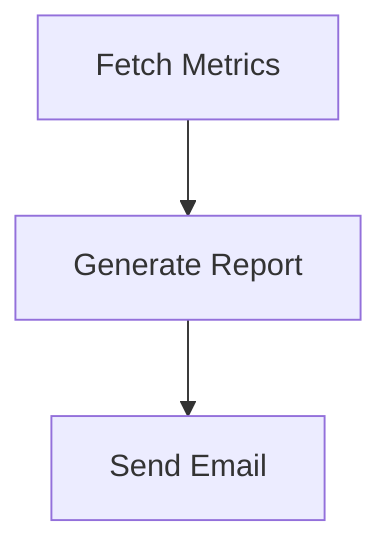

# Scheduled Report

Fetches metrics from an API, generates a formatted report, and emails it to a distribution list. Trigger it via the API or from an external scheduler (e.g. a cron job that calls the AwaitStep API).

## Workflow structure



## Nodes

| #   | Node name       | Type               | Purpose                                     |
| --- | --------------- | ------------------ | ------------------------------------------- |
| 1   | Fetch Metrics   | HTTP Request       | GET metrics from your analytics API         |
| 2   | Generate Report | Step               | Format metrics into a human-readable report |
| 3   | Send Email      | Resend: Send Email | Email the report to the distribution list   |

## Trigger

Use the API trigger to run this workflow on a schedule. For example, set up an external cron job (e.g. GitHub Actions, a cron service, or a simple `crontab` entry) to call the AwaitStep API:

```bash
# Run every weekday at 9 AM UTC
0 9 * * 1-5 curl -X POST https://your-instance/api/workflows/wf_id/trigger \
  -H "Authorization: Bearer ask_yourkey" \
  -H "Content-Type: application/json" \
  -d '{"connectionId": "conn_id", "params": {}}'
```

## Generated TypeScript

```typescript
import { WorkflowEntrypoint, WorkflowEvent, WorkflowStep } from 'cloudflare:workers'

export class ScheduledReportWorkflow extends WorkflowEntrypoint<Env, Params> {
  async run(event: WorkflowEvent<Params>, step: WorkflowStep) {
    const fetch_metrics = await step.do(
      'Fetch Metrics',
      {
        retries: { limit: 3, delay: '30 seconds' },
      },
      async () => {
        const today = new Date().toISOString().split('T')[0]
        const yesterday = new Date(Date.now() - 86_400_000).toISOString().split('T')[0]
        const res = await fetch(`${env.ANALYTICS_API_URL}/metrics?from=${yesterday}&to=${today}`, {
          headers: { Authorization: `Bearer ${env.ANALYTICS_API_KEY}` },
        })
        if (!res.ok) throw new Error(`Metrics API error: ${res.status}`)
        return await res.json()
      },
    )

    const generate_report = await step.do('Generate Report', async () => {
      const { sessions, conversions, revenue } = fetch_metrics
      const conversionRate = sessions > 0 ? ((conversions / sessions) * 100).toFixed(2) : '0.00'
      const revenueFormatted = new Intl.NumberFormat('en-US', {
        style: 'currency',
        currency: 'USD',
      }).format(revenue / 100)

      const subject = `Daily Report — ${new Date().toDateString()}`
      const body = [
        `Daily Performance Report`,
        `========================`,
        `Date:             ${new Date().toDateString()}`,
        `Sessions:         ${sessions.toLocaleString()}`,
        `Conversions:      ${conversions.toLocaleString()}`,
        `Conversion Rate:  ${conversionRate}%`,
        `Revenue:          ${revenueFormatted}`,
      ].join('\n')

      return { subject, body }
    })

    await step.do('Send Email', async () => {
      const res = await fetch('https://api.resend.com/emails', {
        method: 'POST',
        headers: {
          Authorization: `Bearer ${env.RESEND_API_KEY}`,
          'Content-Type': 'application/json',
        },
        body: JSON.stringify({
          from: 'reports@example.com',
          to: env.REPORT_RECIPIENTS.split(','),
          subject: generate_report.subject,
          text: generate_report.body,
        }),
      })
      if (!res.ok) throw new Error(`Resend error: ${res.status}`)
      const result = await res.json()
      return { messageId: result.id }
    })
  }
}
```

## Required env vars

| Variable            | Description                              |
| ------------------- | ---------------------------------------- |
| `ANALYTICS_API_URL` | Base URL of your analytics API           |
| `ANALYTICS_API_KEY` | API key for the analytics service        |
| `RESEND_API_KEY`    | Resend API key                           |
| `REPORT_RECIPIENTS` | Comma-separated list of recipient emails |

## Adding more metrics

Extend the **Fetch Metrics** step to call additional API endpoints, or add a Parallel node to fetch from multiple sources simultaneously before the **Generate Report** step.
