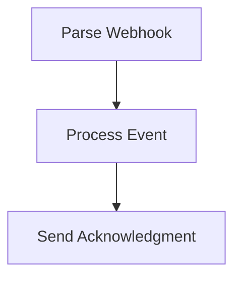

# Webhook Handler

Receives an incoming HTTP webhook, validates the signature, processes the payload durably, and acknowledges the sender.

## Why use a workflow for webhooks?

A plain Worker can receive a webhook and return a 200 immediately, but if downstream processing fails, the event is lost. Wrapping webhook processing in a Cloudflare Workflow gives you automatic retries, durable state, and a full execution trace.

## Workflow structure



## Nodes

| #   | Node name              | Type         | Purpose                                |
| --- | ---------------------- | ------------ | -------------------------------------- |
| 1   | Validate Signature     | Step         | Verify HMAC-SHA256 signature           |
| 2   | Parse Event            | Step         | Extract event type and payload         |
| 3   | Route Event            | Branch       | Different handlers per event type      |
| 4   | Handle Order Created   | Step         | Process `order.created` events         |
| 5   | Handle Order Cancelled | Step         | Process `order.cancelled` events       |
| 6   | Acknowledge            | HTTP Request | POST 200 acknowledgement to the sender |

## Trigger

HTTP trigger. The sending service POSTs to the Worker's URL.

## Generated TypeScript

```typescript
import { WorkflowEntrypoint, WorkflowEvent, WorkflowStep } from 'cloudflare:workers'

export class WebhookHandlerWorkflow extends WorkflowEntrypoint<Env, Params> {
  async run(event: WorkflowEvent<Params>, step: WorkflowStep) {
    const validate_signature = await step.do('Validate Signature', async () => {
      const { rawBody, signature } = event.payload ?? {}
      if (!rawBody || !signature) throw new Error('Missing body or signature')

      const key = await crypto.subtle.importKey(
        'raw',
        new TextEncoder().encode(env.WEBHOOK_SECRET),
        { name: 'HMAC', hash: 'SHA-256' },
        false,
        ['verify'],
      )
      const bodyBytes = new TextEncoder().encode(rawBody)
      const sigBytes = Uint8Array.from(atob(signature), (c) => c.charCodeAt(0))
      const valid = await crypto.subtle.verify('HMAC', key, sigBytes, bodyBytes)
      if (!valid) throw new Error('Invalid signature')
      return { verified: true }
    })

    const parse_event = await step.do('Parse Event', async () => {
      const body = JSON.parse(event.payload?.rawBody ?? '{}')
      return {
        eventType: body.type,
        eventId: body.id,
        data: body.data,
      }
    })

    if (parse_event.eventType === 'order.created') {
      await step.do(
        'Handle Order Created',
        {
          retries: { limit: 5, delay: '10 seconds', backoff: 'exponential' },
        },
        async () => {
          const res = await fetch(`${env.API_BASE_URL}/orders`, {
            method: 'POST',
            headers: { 'Content-Type': 'application/json' },
            body: JSON.stringify(parse_event.data),
          })
          if (!res.ok) throw new Error(`Failed to create order: ${res.status}`)
        },
      )
    } else if (parse_event.eventType === 'order.cancelled') {
      await step.do(
        'Handle Order Cancelled',
        {
          retries: { limit: 5, delay: '10 seconds', backoff: 'exponential' },
        },
        async () => {
          const res = await fetch(`${env.API_BASE_URL}/orders/${parse_event.data?.id}/cancel`, {
            method: 'POST',
          })
          if (!res.ok) throw new Error(`Failed to cancel order: ${res.status}`)
        },
      )
    }

    await step.do('Acknowledge', async () => {
      await fetch(`${env.WEBHOOK_ACK_URL}/${parse_event.eventId}`, {
        method: 'POST',
        headers: { 'Content-Type': 'application/json' },
        body: JSON.stringify({ received: true }),
      })
    })
  }
}
```

## Required env vars

| Variable          | Description                                 |
| ----------------- | ------------------------------------------- |
| `WEBHOOK_SECRET`  | HMAC secret shared with the sending service |
| `API_BASE_URL`    | Base URL of your backend API                |
| `WEBHOOK_ACK_URL` | URL to POST acknowledgements to             |

## Customising the HTTP trigger code

The default trigger code immediately creates a Workflow instance and returns the `instanceId`. For webhook senders that expect a `200 OK` with no body latency, this is fast enough. If the sender requires a specific response body, customise the trigger code in **Settings → Trigger Code**:

```typescript
if (request.method === 'POST') {
  const rawBody = await request.text()
  const signature = request.headers.get('X-Webhook-Signature') ?? ''
  const instance = await env.WORKFLOW.create({
    params: { rawBody, signature },
  })
  return Response.json({ received: true, instanceId: instance.id })
}
return new Response(null, { status: 405 })
```
