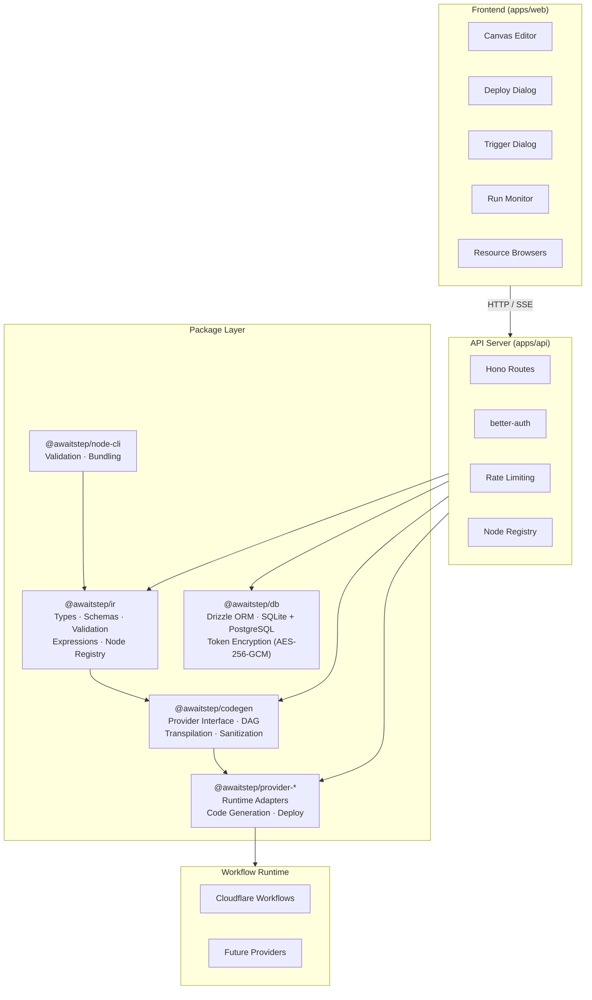
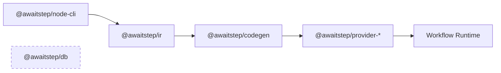

# Architecture

## System Overview



## Package Dependency Flow



Packages must not have circular dependencies. Dependency flow: `ir` → `codegen` → `provider-*`. `@awaitstep/db` is standalone — no dependency on other workspace packages.

## Providers

The system is designed around a pluggable provider model. Each provider lives in its own package (`packages/provider-[name]`) and implements the `WorkflowProvider` interface. Adding a new runtime only requires a new provider package — no changes to core packages or API routes.

| Provider             | Package                          | Status  |
| -------------------- | -------------------------------- | ------- |
| Cloudflare Workflows | `@awaitstep/provider-cloudflare` | Shipped |
| Trigger.dev          | —                                | Planned |

Each provider is responsible for:

- **Code generation** — transforming WorkflowIR into runtime-specific TypeScript
- **Deployment** — packaging and deploying the generated code
- **Runtime API** — triggering runs, polling status, fetching logs
- **Resource browsing** — listing available platform resources (storage, queues, etc.)

## Data Flow: Build → Deploy → Run

```
1. BUILD
   Canvas State → WorkflowIR → Provider.generateCode() → TypeScript → sucrase → JavaScript

2. DEPLOY
   Resolve workflow env vars (including {{global.env.NAME}} refs)
   → Validate required vars from node secret fields
   → Provider.deploy() → packages + secrets to workflow runtime

3. TRIGGER
   POST /api/workflows/:id/trigger → Provider runtime API → Workflow Run

4. MONITOR
   Poll provider status API → Update DB → SSE to frontend → Canvas overlay
```

## Key Design Decisions

### Runtime-Agnostic Core

All app code (API routes, business logic) is runtime-agnostic. No `process.env` or
Node-specific APIs outside of entry points. The Web Crypto API is used for token
encryption so it works on Node.js, Cloudflare Workers, Deno, and Bun.

Entry points (`apps/api/src/entry/node.ts` for local dev, `apps/api/src/entry/docker.ts`
for Docker deployments) are the only files that read environment variables and initialize
platform-specific resources. The app factory (`createApp`) receives everything it needs
as parameters.

### Provider Interface

The `WorkflowProvider` interface in `@awaitstep/codegen` defines the contract for
any workflow runtime. Provider-specific logic (API calls, credential verification,
deploy mechanics, resource browsing) lives entirely in `packages/provider-[name]`.
API routes call methods on `WorkflowProvider` — they never contain provider-specific code.

```typescript
interface WorkflowProvider {
  name: string
  validate(config): Promise<Result<WorkflowStatus, ValidationError>>
  generateCode(ir, options): Promise<Result<GeneratedArtifact, ValidationError>>
  deploy(artifact, config): Promise<Result<DeployResult, ValidationError>>
  checkCredentials(config): Promise<CredentialsCheckResult>
}
```

### IR-First Architecture

The WorkflowIR is the single source of truth. The canvas serializes to IR,
codegen reads IR, validation operates on IR, and versioning stores IR as JSON.
The IR is provider-agnostic — provider packages transform it into runtime-specific code.

### Token Encryption

API tokens and secrets are encrypted at rest using AES-256-GCM via the Web Crypto API.
The `TokenCrypto` interface is injected into the database adapter, keeping the
encryption implementation decoupled from storage.

## Environment Variables

Two-tier model for managing secrets and configuration:

- **Global vars** — stored in `env_vars` table, encrypted at rest, scoped per user.
  Managed via Resources → Environment Variables (textarea `.env` editor).
- **Workflow vars** — stored as JSON in `workflows.envVars` column.
  Each has a name and value. Values can be direct or reference globals via `{{global.env.NAME}}`.

Resolution happens at deploy time:

1. Collect workflow env vars
2. Resolve `{{global.env.NAME}}` references by looking up the global table
3. Validate all required vars exist (from node `secret` config fields)
4. Pass resolved vars and secrets to the provider's deploy method

Saving is always allowed — only deploy blocks on missing vars.

In node config fields, `{{env.NAME}}` emits a bare `env.NAME` runtime reference in
generated code. The `interface Env` is auto-populated with all referenced env var names.

## Custom Nodes

All nodes (builtin and custom) share the `NodeDefinition` model with `configSchema`, `outputSchema`, optional `dependencies`, and provider-specific templates. See [custom-nodes.md](custom-nodes.md) for full documentation.

## Compilation Pipeline

The compilation pipeline transforms canvas state through IR, code generation, transpilation, and deployment. See [compilation.md](compilation.md) for full documentation.

## API Routes

| Endpoint                             | Purpose                    |
| ------------------------------------ | -------------------------- |
| `POST /api/workflows`                | Create workflow            |
| `GET /api/workflows`                 | List user workflows        |
| `GET /api/workflows/:id`             | Fetch workflow             |
| `PUT /api/workflows/:id`             | Update workflow            |
| `DELETE /api/workflows/:id`          | Delete workflow            |
| `POST /api/workflows/:id/deploy`     | Deploy to provider         |
| `GET /api/workflows/:id/deployments` | Deployment history         |
| `POST /api/workflows/:id/trigger`    | Trigger workflow run       |
| `GET /api/workflows/:id/runs`        | List runs                  |
| `GET /api/runs/:id`                  | Run status                 |
| `POST /api/env-vars`                 | Create env var             |
| `GET /api/env-vars`                  | List env vars              |
| `PUT /api/env-vars/:id`              | Update env var             |
| `DELETE /api/env-vars/:id`           | Delete env var             |
| `POST /api/connections`              | Create provider connection |
| `GET /api/connections`               | List connections           |
| `POST /api/api-keys`                 | Generate API key           |
| `GET /api/api-keys`                  | List API keys              |
| `POST /api/api-keys/:id/revoke`      | Revoke API key             |
| `GET /api/nodes`                     | Custom node definitions    |
| `GET /api/nodes/templates`           | Node templates             |
| `GET /api/resources/:type`           | List provider resources    |

## Database Schema

Drizzle ORM with runtime-selected database: PostgreSQL when `DATABASE_URL` is set, SQLite otherwise. Both are fully supported in any deployment mode.

| Table             | Purpose                                      |
| ----------------- | -------------------------------------------- |
| `projects`        | Project metadata (org-scoped)                |
| `workflows`       | Workflow metadata + env vars JSON            |
| `versions`        | IR + generated code history                  |
| `deployments`     | Deployment records                           |
| `runs`            | Workflow execution instances                 |
| `env_vars`        | Global environment variables (encrypted)     |
| `connections`     | Provider credentials (encrypted)             |
| `api_keys`        | Scoped API keys (project-scoped)             |
| `installed_nodes` | Marketplace node bundles (org-scoped)        |
| `auth_*`          | better-auth session/user/organization tables |
