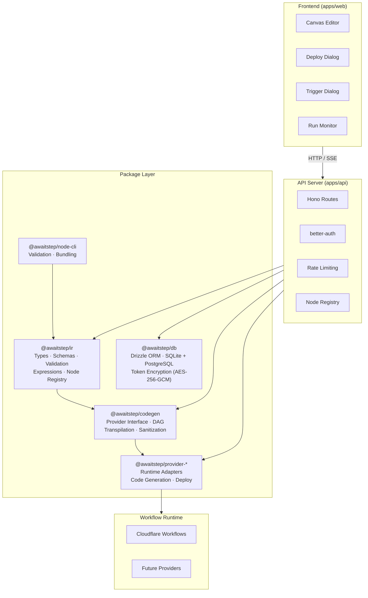
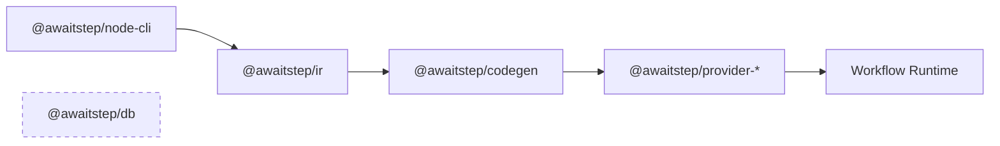

# Architecture

## System Overview



## Package Dependency Flow



Packages must not have circular dependencies. Dependency flow: `ir` → `codegen` → `provider-*`. `@awaitstep/db` is standalone — no dependency on other workspace packages.

## Providers

The system is designed around a pluggable provider model. Each provider lives in its own package (`packages/provider-[name]`) and implements the `WorkflowProvider` interface. Adding a new runtime only requires a new provider package — no changes to core packages or API routes.

| Provider             | Package                          | Status  |
| -------------------- | -------------------------------- | ------- |
| Cloudflare Workflows | `@awaitstep/provider-cloudflare` | Shipped |
| Trigger.dev          | —                                | Planned |

Each provider is responsible for:

- **Code generation** — transforming WorkflowIR into runtime-specific TypeScript
- **Deployment** — packaging and deploying the generated code
- **Runtime API** — triggering runs, polling status, fetching logs
- **Resource browsing** — listing available platform resources (storage, queues, etc.)

## Data Flow: Build → Deploy → Run

```
1. BUILD
   Canvas State → WorkflowIR → Provider.generateCode() → TypeScript → sucrase → JavaScript

2. DEPLOY
   Resolve workflow env vars (including {{global.env.NAME}} refs)
   → Validate required vars from node secret fields
   → Provider.deploy() → packages + secrets to workflow runtime

3. TRIGGER
   POST /api/workflows/:id/trigger → Provider runtime API → Workflow Run

4. MONITOR
   Frontend polls run status API → Fetch live status from provider → Update DB → JSON response → Canvas overlay
```

## Key Design Decisions

### Runtime-Agnostic Core

All app code (API routes, business logic) is runtime-agnostic. No `process.env` or
Node-specific APIs outside of entry points. The Web Crypto API is used for token
encryption so it works on Node.js, Cloudflare Workers, Deno, and Bun.

Entry points (`apps/api/src/entry/dev.ts` for local development, `apps/api/src/entry/serve.ts`
for production) are the only files that read environment variables and initialize
platform-specific resources. The app factory (`createApp`) receives everything it needs
as parameters.

### Provider Interface

The `WorkflowProvider` interface in `@awaitstep/codegen` defines the contract for
any workflow runtime. Provider-specific logic (API calls, credential verification,
deploy mechanics, resource browsing) lives entirely in `packages/provider-[name]`.
API routes call methods on `WorkflowProvider` — they never contain provider-specific code.

```typescript
interface WorkflowProvider {
  readonly name: string
  validate(ir: WorkflowIR): Result<void, ValidationError[]>
  verifyCredentials(config: ProviderConfig): Promise<CredentialsCheckResult>
  generate(ir: WorkflowIR, config?: ProviderConfig): GeneratedArtifact
  deploy(artifact: GeneratedArtifact, config: ProviderConfig): Promise<DeployResult>
  getStatus(instanceId: string, config: ProviderConfig): Promise<WorkflowRunStatus>
  trigger(
    deploymentId: string,
    params: unknown,
    config: ProviderConfig,
  ): Promise<{ instanceId: string }>
  destroy(
    deploymentId: string,
    config: ProviderConfig,
  ): Promise<{ success: boolean; error?: string }>
}
```

### IR-First Architecture

The WorkflowIR is the single source of truth. The canvas serializes to IR,
codegen reads IR, validation operates on IR, and versioning stores IR as JSON.
The IR is provider-agnostic — provider packages transform it into runtime-specific code.

### Workflow Import / Export

Workflows can be exported and imported as `.ir.json` files containing the full `WorkflowIR` document (metadata, nodes, edges, entryNodeId).

**Export** is available from:

- **Canvas toolbar** — "Export" button builds IR from the current editor state and downloads it. Available when the canvas has at least one node.
- **Workflow actions menu** — "Export IR" option on the workflow overview and list pages. Fetches the current version's IR from the API on demand.

**Import** is available from the Workflows list page via the "Import" button. The import dialog supports two input modes:

- **Paste JSON** — Monaco editor with JSON syntax highlighting for pasting IR directly.
- **Upload file** — File picker or drag-and-drop for `.json` files.

On input, the IR is validated client-side using `validateIR()` from `@awaitstep/ir` (schema + structural checks). If valid, the user can edit the workflow name before importing. Import creates a new workflow via `POST /workflows` and saves the IR as version 1 via `POST /workflows/:id/versions`, then navigates to the canvas editor.

### Token Encryption

API tokens and secrets are encrypted at rest using AES-256-GCM via the Web Crypto API.
The `TokenCrypto` interface is injected into the database adapter, keeping the
encryption implementation decoupled from storage.

## Environment Variables

Two-tier model for managing secrets and configuration:

- **Global vars** — stored in `env_vars` table, encrypted at rest, scoped per organization (optionally per project).
  Managed via the Environment Variables page.
- **Workflow vars** — stored as JSON in `workflows.envVars` column.
  Each has a name and value. Values can be direct or reference globals via `{{global.env.NAME}}`.

Resolution happens at deploy time:

1. Collect workflow env vars
2. Resolve `{{global.env.NAME}}` references by looking up the global table
3. Validate all required vars exist (from node `secret` config fields)
4. Pass resolved vars and secrets to the provider's deploy method

Saving is always allowed — only deploy blocks on missing vars.

In node config fields, `{{env.NAME}}` emits a bare `env.NAME` runtime reference in
generated code. The `interface Env` is auto-populated with all referenced env var names.

## Custom Nodes

All nodes (builtin and custom) share the `NodeDefinition` model with `configSchema`, `outputSchema`, optional `dependencies`, and provider-specific templates. See [custom-nodes.md](custom-nodes.md) for full documentation.

## Compilation Pipeline

The compilation pipeline transforms canvas state through IR, code generation, transpilation, and deployment. See [compilation.md](compilation.md) for full documentation.

## API Routes

Key routes are listed below. See [api-reference.md](api-reference.md) for the complete API reference including request/response schemas.

| Endpoint                                            | Purpose                     |
| --------------------------------------------------- | --------------------------- |
| `POST /api/workflows`                               | Create workflow             |
| `GET /api/workflows`                                | List user workflows         |
| `GET /api/workflows/:id`                            | Fetch workflow              |
| `GET /api/workflows/:id/full`                       | Workflow + version + deploy |
| `PATCH /api/workflows/:id`                          | Update workflow             |
| `PATCH /api/workflows/:id/move`                     | Move to another project     |
| `DELETE /api/workflows/:id`                         | Delete workflow             |
| `GET/POST/PATCH/DELETE /api/workflows/:id/versions` | Version CRUD + lock         |
| `POST /api/workflows/:id/versions/:vid/revert`      | Revert to version           |
| `POST /api/workflows/:id/deploy`                    | Deploy to provider          |
| `POST /api/workflows/:id/deploy-stream`             | Deploy with SSE progress    |
| `POST /api/workflows/:id/takedown`                  | Remove deployment           |
| `GET /api/workflows/:id/deployments`                | Deployment history          |
| `GET /api/deployments`                              | List all deployments        |
| `POST /api/workflows/:id/trigger`                   | Trigger workflow run        |
| `GET /api/workflows/:id/runs`                       | List runs                   |
| `GET /api/workflows/:wid/runs/:rid`                 | Run status                  |
| `POST /api/workflows/:wid/runs/:rid/pause`          | Pause run                   |
| `POST /api/workflows/:wid/runs/:rid/resume`         | Resume run                  |
| `POST /api/workflows/:wid/runs/:rid/terminate`      | Terminate run               |
| `GET /api/runs`                                     | List all runs               |
| `GET/POST/PATCH/DELETE /api/projects`               | Project CRUD                |
| `GET/POST/PATCH/DELETE /api/connections`            | Connection CRUD             |
| `POST /api/connections/verify-token`                | Verify credentials          |
| `GET/POST/PATCH/DELETE /api/env-vars`               | Env var CRUD                |
| `GET/POST /api/api-keys`                            | Generate / list API keys    |
| `DELETE /api/api-keys/:id`                          | Revoke API key              |
| `GET /api/nodes`                                    | Custom node definitions     |
| `GET /api/nodes/templates`                          | Node templates              |
| `GET /api/resources/...`                            | KV, D1, R2 resources        |
| `GET/POST /api/marketplace/...`                     | Marketplace browse/install  |

## Database Schema

Drizzle ORM with runtime-selected database: PostgreSQL when `DATABASE_URL` is set, SQLite otherwise. Both are fully supported in any deployment mode.

| Table               | Purpose                                      |
| ------------------- | -------------------------------------------- |
| `projects`          | Project metadata (org-scoped)                |
| `workflows`         | Workflow metadata + env vars JSON            |
| `workflow_versions` | IR + generated code history                  |
| `deployments`       | Deployment records                           |
| `workflow_runs`     | Workflow execution instances                 |
| `env_vars`          | Global environment variables (encrypted)     |
| `connections`       | Provider credentials (encrypted)             |
| `api_keys`          | Scoped API keys (project-scoped)             |
| `installed_nodes`   | Marketplace node bundles (org-scoped)        |
| `auth_*`            | better-auth session/user/organization tables |
