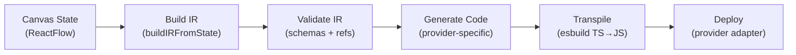
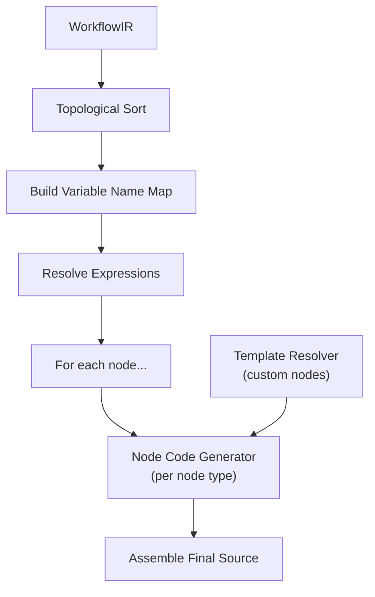
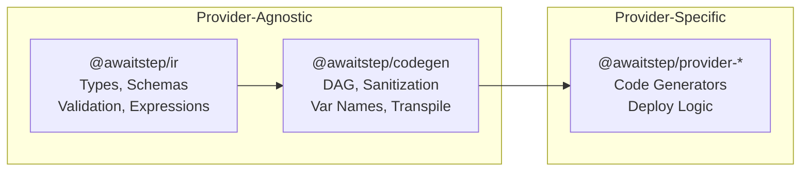

# Compilation Pipeline

This document describes how AwaitStep transforms a visual canvas into executable workflow code and deploys it to a provider.

## Pipeline Overview



Each stage is a pure transformation with well-defined inputs and outputs:

| Stage         | Input                                  | Output                           | Package                 |
| ------------- | -------------------------------------- | -------------------------------- | ----------------------- |
| Build IR      | Canvas state (nodes, edges, positions) | `WorkflowIR`                     | `apps/web`              |
| Validate      | `WorkflowIR`                           | Validated IR or errors           | `@awaitstep/ir`         |
| Generate Code | `WorkflowIR` + templates               | `GeneratedArtifact` (TypeScript) | `@awaitstep/provider-*` |
| Transpile     | TypeScript source                      | JavaScript source                | `@awaitstep/codegen`    |
| Deploy        | JavaScript + config + secrets          | Deployed worker                  | `@awaitstep/provider-*` |

## Stage 1: Canvas → IR

**Location:** `apps/web/src/lib/build-ir.ts`

The canvas stores nodes and edges as ReactFlow objects. `buildIRFromState()` converts this to a `WorkflowIR`:

1. Extract `irNode` data from each canvas node
2. Convert ReactFlow edges to IR edges (with optional labels for branches)
3. Detect the entry node (root of the DAG, or largest connected subtree)
4. Assemble the `WorkflowIR` with metadata, nodes, edges, and entry point

### WorkflowIR Structure

```typescript
interface WorkflowIR {
  metadata: {
    name: string
    version: string
    createdAt: string
    updatedAt: string
  }
  nodes: WorkflowNode[]
  edges: Edge[]
  entryNodeId: string
  trigger?: TriggerConfig
}

interface WorkflowNode {
  id: string
  type: string // 'step', 'branch', 'resend_send_email', etc.
  name: string
  position: { x: number; y: number }
  version: string
  provider: string
  data: Record<string, unknown> // Config values from the UI
  config?: StepConfig // Retry/timeout overrides
}

interface Edge {
  id: string
  source: string // Source node ID
  target: string // Target node ID
  label?: string // Branch condition label
}
```

The IR is provider-agnostic. It captures _what_ the workflow does without encoding _how_ any particular runtime executes it.

## Stage 2: Validation

**Location:** `packages/ir/src/validate.ts`, `packages/ir/src/schema.ts`

Validation runs against the IR before code generation:

1. **Schema validation** — Zod schemas verify structural correctness (types, required fields, formats)
2. **DAG validation** — topological sort detects cycles
3. **Reference validation** — expression references (`{{step1.output}}`) resolve to actual node outputs
4. **Entry node validation** — entry node exists and is reachable

Validation errors are collected and returned as an array, not thrown — this allows the UI to display all issues at once.

## Stage 3: Code Generation

Code generation transforms the validated IR into provider-specific TypeScript. This is the most involved stage.

### Architecture



### Step-by-Step

**1. Topological Sort** (`packages/codegen/src/dag.ts`)

Nodes are sorted in execution order based on edge dependencies. This ensures that upstream outputs are available before downstream nodes reference them.

```typescript
topologicalSort(ir: WorkflowIR): string[]  // Returns ordered node IDs
buildAdjacencyList(ir: WorkflowIR): Map<string, string[]>
getEdgeLabels(ir: WorkflowIR): Map<string, string>  // edge ID → label
```

**2. Variable Name Mapping** (`packages/codegen/src/var-names.ts`)

Each node gets a human-readable variable name derived from its display name:

```
"Fetch User Data" → fetch_user_data
"Fetch User Data" → fetch_user_data_2  (deduplication)
"Send Email"      → send_email
```

The mapping (`varNameMap`) is used throughout code generation to reference step results.

**3. Identifier Sanitization** (`packages/codegen/src/sanitize.ts`)

```typescript
sanitizeIdentifier(name: string): string       // "My Step!" → "my_step"
buildVarNameMap(nodes: WorkflowNode[]): Map     // node ID → safe variable name
deduplicateStepNames(nodes: WorkflowNode[]): Map
```

Handles unicode, special characters, reserved words, and collisions.

**4. Expression Resolution** (`packages/ir/src/expressions.ts`)

Template expressions like `{{fetch_user.id}}` in node config are detected and resolved to actual variable references in the generated code.

Pattern: `{{identifier.path.to.field}}`

**5. Node Code Generation**

Each node type has a dedicated generator. The provider package implements these generators to produce runtime-specific code.

#### Built-in Node Generators

**Step** — Wraps user code in a step execution call:

```typescript
const fetch_user = await step.do('Fetch User', async () => {
  // user's code from data.code
})
```

**Sleep / Sleep Until** — Duration or timestamp-based pauses:

```typescript
await step.sleep('Wait 5s', '5 seconds')
await step.sleepUntil('Wait until midnight', new Date('2025-01-01T00:00:00Z'))
```

**Branch** — Conditional logic with inlined child nodes:

```typescript
if (condition_a) {
  const step_a = await step.do("Step A", async () => { ... });
} else if (condition_b) {
  const step_b = await step.do("Step B", async () => { ... });
} else {
  const fallback = await step.do("Fallback", async () => { ... });
}
```

Branch nodes use `collectChain()` to inline downstream nodes within each branch body, avoiding separate top-level statements.

**Parallel** — Concurrent execution via `Promise.all`:

```typescript
await Promise.all(
  [
    async () => {
      /* branch 1 */
    },
    async () => {
      /* branch 2 */
    },
  ].map((fn) => fn()),
)
```

**HTTP Request** — Fetch call wrapped in a step:

```typescript
const api_call = await step.do('API Call', async () => {
  const response = await fetch('https://api.example.com/data', {
    method: 'POST',
    headers: { 'Content-Type': 'application/json' },
    body: JSON.stringify({ key: 'value' }),
  })
  return response.json()
})
```

**Wait for Event** — Pauses until an external event arrives:

```typescript
const payment = await step.waitForEvent('Wait for Payment', {
  type: 'payment.completed',
  timeout: '24 hours',
})
```

**Custom Nodes** — Template-based generation:

1. Fetch the node's template from the template resolver
2. Extract the function body from the `export default async function` wrapper
3. Replace `ctx.config.*` with actual config values
4. Replace `ctx.env.*` with environment variable references
5. Replace `ctx.inputs.*` with upstream node output references
6. Wrap in a `step.do()` call

#### Template Resolution

The `TemplateResolver` interface provides templates at generation time:

```typescript
interface TemplateResolver {
  getTemplate(nodeType: string, provider: string): string | undefined
}
```

For custom nodes, templates are loaded from the node registry. Provider-specific templates are preferred over the default template.

**6. Import Hoisting**

Generated node code may contain import statements. These are extracted, deduplicated, and hoisted to the top of the final source file.

**7. Environment Variable Collection**

The generator scans all node code for `env.*` references and builds the `interface Env` block with all referenced variable names.

**8. Final Assembly**

The provider assembles the generated node code into a complete source file. The structure depends on the provider — for example, a class extending a base entrypoint, a function export, etc.

### Generated Artifact

```typescript
interface GeneratedArtifact {
  filename: string // e.g. "worker.ts"
  source: string // TypeScript source
  compiled?: string // JavaScript (populated after transpilation)
}
```

## Stage 4: Transpilation

**Location:** `packages/codegen/src/transpile.ts`

The TypeScript source is transpiled to JavaScript using esbuild:

- **Loader:** `ts`
- **Format:** `esm` (ES modules)
- **Target:** `es2022`
- **Minify:** `false` (keeps output readable for debugging)

```typescript
transpileToJS(tsSource: string): Promise<string>
```

This runs during the deployment phase, not during live preview. The editor panel shows TypeScript source directly.

## Stage 5: Deployment

**Location:** `packages/provider-*/src/deploy.ts`, `apps/api/src/routes/deploy.ts`

### API Orchestration

The deploy API route (`POST /api/workflows/:id/deploy`) orchestrates:

1. **Load** workflow, connection, and latest version from the database
2. **Verify credentials** with the provider
3. **Collect dependencies** — merge workflow-level and per-node npm dependencies
4. **Resolve environment variables**:
   - Collect required vars from node `secret` fields
   - Resolve `{{global.env.NAME}}` references from the global env var table
   - Validate all required vars are present
   - Separate into public vars and secrets
5. **Generate code** via `provider.generate(ir, config)`
6. **Deploy** via `provider.deploy(artifact, config)`
7. **Persist** deployment record (status, service URL, errors)

### Provider Deploy

Each provider handles the actual deployment mechanics. The provider receives a `ProviderConfig`:

```typescript
interface ProviderConfig {
  provider: string
  credentials: Record<string, string>
  options?: Record<string, unknown>
  envVars?: Record<string, { value: string; isSecret: boolean }>
}
```

The provider is responsible for:

- Transpiling TypeScript to JavaScript
- Writing deployment artifacts to a temp directory
- Installing npm dependencies (if any)
- Deploying to the runtime platform
- Injecting secrets
- Returning deployment results (URL, status, errors)

### Streaming Deploy

The API also supports `POST /api/workflows/:id/deploy-stream` which sends Server-Sent Events with progress updates:

```
INITIALIZING → GENERATING_CODE → CODE_READY → DETECTING_BINDINGS →
BINDINGS_READY → CREATING_WORKER → DEPLOYING → WORKER_DEPLOYED →
UPDATING_WORKFLOW → COMPLETED
```

## Live Code Preview

**Location:** `apps/web/src/components/canvas/editor-panel.tsx`

The web app provides real-time code preview as the user builds workflows:

1. Build IR from current canvas state
2. Fetch custom node templates from `/api/nodes/templates`
3. Run provider code generation on the IR
4. Display the TypeScript source in Monaco editor

This uses the same `generateWorkflow()` function as deployment but skips transpilation and deployment. The preview updates on every canvas change.

The editor panel also provides tabs for:

- **Trigger code** — custom entry point handler
- **Dependencies** — npm packages as JSON
- **IR JSON** — raw WorkflowIR for debugging

## Dependency Flow



The `@awaitstep/ir` and `@awaitstep/codegen` packages contain no provider-specific code. All runtime-specific logic (code structure, deployment commands, API calls) lives in `packages/provider-*`. Adding a new provider means implementing the `WorkflowProvider` interface and the node code generators — no changes to IR or codegen.
