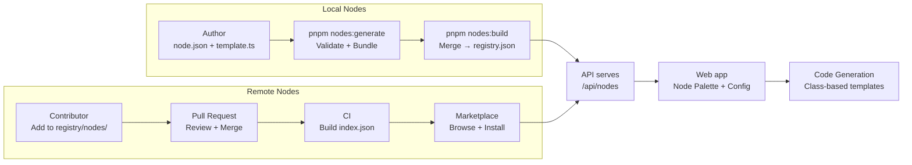

# Custom Nodes

AwaitStep ships with a set of built-in nodes (step, sleep, branch, parallel, etc.) but supports extending the workflow canvas with custom nodes. Custom nodes can be **local** (bundled at build time from the `nodes/` directory) or **remote** (installed from the marketplace registry).

## Overview



## Node Types

### Local Nodes

Local nodes live in the `nodes/` directory and are bundled at build time. Use these for project-specific nodes or development/testing.

```
nodes/
├── registry.json              # Generated: all definitions + custom templates
├── nodes.local.json           # Generated: custom node bundles only
└── my_custom_node/
    ├── node.json              # Node definition
    ├── template.ts            # Default template
    └── templates/             # Optional provider-specific overrides
        └── cloudflare.ts
```

### Remote Nodes (Marketplace)

Remote nodes live in `registry/nodes/` and are installed per-organization via the marketplace UI. Each node is versioned:

```
registry/nodes/
├── stripe/
│   ├── icon.svg               # Brand icon (served via raw GitHub URL)
│   └── 1.0.0/
│       ├── node.json
│       └── template.ts
├── slack/
│   ├── icon.svg
│   └── 1.0.0/
│       ├── node.json
│       └── template.ts
└── ...
```

To add a new remote node, submit a PR adding a directory under `registry/nodes/`. CI validates the definition and rebuilds `index.json` after merge.

## Node Definition (`node.json`)

Every node is described by a `NodeDefinition`:

```json
{
  "id": "stripe",
  "name": "Stripe",
  "version": "1.0.0",
  "description": "Interact with the Stripe API for payments and customers",
  "category": "Payments",
  "icon": "https://raw.githubusercontent.com/awaitstep/awaitstep.dev/main/registry/nodes/stripe/icon.svg",
  "tags": ["stripe", "payments", "billing"],
  "author": "awaitstep",
  "license": "Apache-2.0",
  "providers": ["cloudflare"],
  "configSchema": { ... },
  "outputSchema": { ... },
  "dependencies": { ... },
  "runtime": { ... }
}
```

### Required Fields

| Field          | Type                          | Rules                                                    |
| -------------- | ----------------------------- | -------------------------------------------------------- |
| `id`           | string                        | Must match directory name. Pattern: `^[a-z][a-z0-9_-]*$` |
| `name`         | string                        | Human-readable display name                              |
| `version`      | string                        | Semver (e.g. `1.0.0`)                                    |
| `description`  | string                        | Max 120 characters                                       |
| `category`     | Category                      | One of the predefined categories (see below)             |
| `author`       | string                        | Author name                                              |
| `license`      | string                        | SPDX license identifier                                  |
| `providers`    | Provider[]                    | At least one supported provider                          |
| `configSchema` | Record\<string, ConfigField\> | Input fields rendered in the UI                          |
| `outputSchema` | Record\<string, OutputField\> | Shape of step results                                    |

### Optional Fields

| Field                | Type                     | Purpose                                     |
| -------------------- | ------------------------ | ------------------------------------------- |
| `tags`               | string[]                 | Searchable tags                             |
| `icon`               | string                   | URL to node icon (use local SVG in repo)    |
| `docsUrl`            | string                   | Link to external docs                       |
| `dependencies`       | Record\<string, string\> | npm packages installed at deploy time       |
| `runtime`            | RuntimeHints             | Default timeout, retries, idempotency hints |
| `deprecated`         | boolean                  | Mark as deprecated                          |
| `deprecationMessage` | string                   | Shown when deprecated                       |
| `replacedBy`         | string                   | ID of replacement node                      |

### Categories

`Payments` · `Email` · `Messaging` · `Database` · `Storage` · `AI` · `Authentication` · `HTTP` · `Scheduling` · `Notifications` · `Data` · `Utilities` · `Control Flow` · `Internal`

### Providers

`cloudflare` · `inngest` · `temporal` · `stepfunctions`

### Icons

Store an `icon.svg` file in the node's directory (not the version directory). Reference it via raw GitHub URL in `node.json`:

```json
{
  "icon": "https://raw.githubusercontent.com/awaitstep/awaitstep.dev/main/registry/nodes/stripe/icon.svg"
}
```

Source SVGs from [Simple Icons](https://simpleicons.org/) or [gilbarbara/logos](https://github.com/gilbarbara/logos).

## Multi-Action Service Nodes

The recommended pattern is **one node per service** with an `action` select field, not one node per API call. This keeps the node palette clean and lets users access all of a service's operations from a single node.

### Action Select Field

```json
{
  "configSchema": {
    "action": {
      "type": "select",
      "label": "Action",
      "required": true,
      "options": [
        "Create Payment Intent",
        "Retrieve Payment Intent",
        "Create Customer",
        "Retrieve Customer",
        "Create Charge",
        "Create Refund"
      ],
      "description": "The Stripe API action to perform."
    },
    "amount": {
      "type": "number",
      "label": "Amount",
      "description": "Amount in smallest currency unit. Used by: Create Payment Intent, Create Charge."
    }
  }
}
```

Annotate each field's description with `Used by:` to indicate which actions use it.

### Switch-Based Template

```typescript
export default async function (ctx) {
  const action = ctx.config.action

  async function apiRequest(method: string, path: string, body?: URLSearchParams) {
    const response = await fetch(`https://api.stripe.com/v1${path}`, {
      method,
      headers: {
        Authorization: `Bearer ${ctx.env.STRIPE_SECRET_KEY}`,
        'Content-Type': 'application/x-www-form-urlencoded',
      },
      body: body?.toString(),
    })
    const data = (await response.json()) as Record<string, unknown>
    if (!response.ok) {
      const err = data.error as { message?: string } | undefined
      throw new Error(`Stripe API error: ${err?.message ?? response.statusText}`)
    }
    return data
  }

  switch (action) {
    case 'Create Payment Intent': {
      const params = new URLSearchParams({
        amount: String(ctx.config.amount),
        currency: ctx.config.currency ?? 'usd',
      })
      const data = await apiRequest('POST', '/payment_intents', params)
      return { id: data.id, status: data.status, data }
    }

    case 'Retrieve Payment Intent': {
      const data = await apiRequest('GET', `/payment_intents/${ctx.config.paymentIntentId}`)
      return { id: data.id, status: data.status, data }
    }

    // ... more cases

    default:
      throw new Error(`Unknown action: ${action}`)
  }
}
```

### Template Rules

- Call `response.json()` **once** — parse the body, then check `response.ok`
- Use a helper function for shared API request logic
- Include a `default` case that throws for unknown actions
- All credential fields must be `type: "secret"` with `required: true` and `envVarName`

## Config Schema

### Field Types

| Type          | UI Control         | Example                          |
| ------------- | ------------------ | -------------------------------- |
| `string`      | Text input         | URL, name, identifier            |
| `number`      | Number input       | Retry count, timeout             |
| `boolean`     | Toggle switch      | Enable/disable flag              |
| `select`      | Dropdown           | Action, HTTP method, format      |
| `multiselect` | Multi-select       | Tags, categories                 |
| `secret`      | Secret input       | API keys (requires `envVarName`) |
| `code`        | Monaco code editor | Custom logic, function body      |
| `json`        | JSON editor        | Headers, request body            |
| `expression`  | Expression input   | `{{step1.output}}` references    |
| `textarea`    | Multi-line text    | HTML body, templates             |

### ConfigField Properties

```typescript
{
  type: FieldType           // Required
  label: string             // Required — display label
  description?: string      // Help text shown below the field
  required?: boolean        // Whether the field must be filled
  default?: unknown         // Default value
  placeholder?: string      // Input placeholder text
  options?: string[]        // Required for select/multiselect
  envVarName?: string       // Required for secret type — maps to env var name
  validation?: {
    min?: number
    max?: number
    minLength?: number
    maxLength?: number
    pattern?: string
    format?: 'email' | 'url' | 'uuid' | 'date' | 'date-time' | 'duration'
  }
}
```

### Secret Fields

Fields with `type: "secret"` must include `envVarName` and `required: true`. At runtime, the secret value is injected as an environment variable:

```json
{
  "apiKey": {
    "type": "secret",
    "label": "API Key",
    "required": true,
    "envVarName": "STRIPE_SECRET_KEY"
  }
}
```

In the template, access it via `ctx.env.STRIPE_SECRET_KEY`.

## Output Schema

Declares the shape of data returned by the node. Downstream nodes can reference these outputs via expressions.

```json
{
  "outputSchema": {
    "id": { "type": "string", "description": "Stripe object ID" },
    "status": { "type": "string", "description": "Object status" },
    "data": { "type": "object", "description": "Full API response" }
  }
}
```

## Dependencies

Nodes can declare npm packages they need at runtime:

```json
{
  "dependencies": {
    "@supabase/supabase-js": "^2"
  }
}
```

Dependencies are installed during the deploy phase. When a workflow uses multiple custom nodes, their dependencies are merged before deployment.

## Templates

### Template Context

```typescript
export default async function (ctx: {
  config: Record<string, unknown> // Values from configSchema fields
  env: Record<string, string> // Environment variables (from secret fields)
  inputs: Record<string, unknown> // Outputs from upstream nodes
}) {
  // Node implementation
  return {
    /* matches outputSchema */
  }
}
```

### Code Generation

Custom node templates are compiled into static class methods in the generated workflow code:

```typescript
// Generated class (hoisted above the workflow)
class Stripe {
  static async execute(env: Env, params: Record<string, unknown>) {
    // Template body with ctx.config.* → params.*, ctx.env.* → env.*
  }
}

// In the workflow's run() method
const result = await step.do('Create Payment', { retries: { limit: 3 } }, async () => {
  return Stripe.execute(this.env, {
    action: 'Create Payment Intent',
    amount: 5000,
    currency: 'usd',
  })
})
```

The class is generated once per node type (not per instance). Multiple instances of the same node type share the class but pass different params.

### Provider-Specific Templates

By default, `template.ts` is used for all providers. To provide provider-specific implementations:

```
my_node/
├── node.json
├── template.ts            # Fallback for any provider
└── templates/
    └── cloudflare.ts      # Cloudflare-specific
```

## Local Node Build Pipeline

### 1. Generate (`pnpm nodes:generate`)

Scans `nodes/`, validates each node, computes checksums, writes `nodes/nodes.local.json`.

### 2. Build (`pnpm nodes:build`)

Merges built-in + custom nodes into `nodes/registry.json`. Runs automatically before `pnpm build` via the `prebuild` hook.

## Remote Node Marketplace

### How It Works

1. Nodes are added to `registry/nodes/{nodeId}/{version}/` via PR
2. After merge to main, CI rebuilds `registry/index.json`
3. The API fetches `index.json` from the configured `REGISTRY_URL`
4. Users browse the marketplace in the web UI and install nodes per-organization
5. Installed node bundles (definition + templates) are stored in the database
6. At deploy time, installed node templates are merged with local ones

### Adding a Remote Node

```bash
# 1. Create the node directory
mkdir -p registry/nodes/my_service/1.0.0

# 2. Add node.json and template.ts
# 3. Add icon.svg to registry/nodes/my_service/

# 4. Submit a PR — CI validates the definition
# 5. After merge, CI rebuilds index.json
# 6. Node appears in the marketplace
```

### Versioning

Each version is a directory (`1.0.0/`, `1.1.0/`, etc.). When a user installs a node, the full bundle is pinned in the database. Updates are explicit — the marketplace shows "Update available" when a newer version exists.

### Install Flow

1. User clicks "Install" in the marketplace dialog
2. API fetches the node bundle from the registry (via `REGISTRY_URL`)
3. Checksums are verified
4. Bundle is stored in `installed_nodes` table (org-scoped)
5. Node appears in the palette and is available for use in workflows
6. At deploy time, templates resolve from the stored bundle (no GitHub dependency)

### Configuration

Set `REGISTRY_URL` in your `.env`:

```
REGISTRY_URL=https://raw.githubusercontent.com/awaitstep/awaitstep.dev/main/registry
```

## Authoring Checklist

- [ ] `id` in `node.json` matches directory name (lowercase snake_case)
- [ ] `description` is under 120 characters
- [ ] At least one provider in `providers`
- [ ] All credential fields: `type: "secret"`, `required: true`, `envVarName: "..."`
- [ ] All `select`/`multiselect` fields have non-empty `options`
- [ ] Service nodes use an `action` select field with a `switch` in the template
- [ ] Template calls `response.json()` only once, then checks `response.ok`
- [ ] Template returns an object matching `outputSchema`
- [ ] `icon.svg` added for remote nodes
- [ ] `pnpm nodes:build` passes for local nodes
