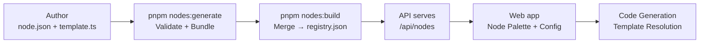

# Custom Nodes

AwaitStep ships with a set of built-in nodes (step, sleep, branch, parallel, etc.) but supports extending the workflow canvas with custom nodes. Custom nodes use the same `NodeDefinition` model as built-in ones and plug into the same code generation, validation, and deployment pipeline.

## Overview



## Directory Structure

Each custom node lives in its own directory under `nodes/`:

```
nodes/
├── registry.json              # Generated: all definitions + custom templates
├── nodes.local.json           # Generated: custom node bundles only
└── resend_send_email/         # Example custom node
    ├── node.json              # Node definition (metadata, schemas)
    ├── template.ts            # Default template (all providers)
    └── templates/             # Optional provider-specific overrides
        ├── cloudflare.ts
        └── trigger-dev.ts
```

## Node Definition (`node.json`)

Every node is described by a `NodeDefinition`:

```json
{
  "id": "resend_send_email",
  "name": "Resend Send Email",
  "version": "1.0.0",
  "description": "Sends an email via the Resend API",
  "category": "Email",
  "tags": ["email", "resend", "transactional"],
  "author": "awaitstep",
  "license": "Apache-2.0",
  "providers": ["cloudflare"],
  "configSchema": { ... },
  "outputSchema": { ... },
  "dependencies": { ... },
  "runtime": { ... }
}
```

### Required Fields

| Field          | Type                          | Rules                                                    |
| -------------- | ----------------------------- | -------------------------------------------------------- |
| `id`           | string                        | Must match directory name. Pattern: `^[a-z][a-z0-9_-]*$` |
| `name`         | string                        | Human-readable display name                              |
| `version`      | string                        | Semver (e.g. `1.0.0`)                                    |
| `description`  | string                        | Max 120 characters                                       |
| `category`     | Category                      | One of the predefined categories (see below)             |
| `author`       | string                        | Author name                                              |
| `license`      | string                        | SPDX license identifier                                  |
| `providers`    | Provider[]                    | At least one supported provider                          |
| `configSchema` | Record\<string, ConfigField\> | Input fields rendered in the UI                          |
| `outputSchema` | Record\<string, OutputField\> | Shape of step results                                    |

### Optional Fields

| Field                | Type                     | Purpose                                     |
| -------------------- | ------------------------ | ------------------------------------------- |
| `tags`               | string[]                 | Searchable tags                             |
| `icon`               | string                   | URL to node icon                            |
| `docsUrl`            | string                   | Link to external docs                       |
| `dependencies`       | Record\<string, string\> | npm packages installed at deploy time       |
| `runtime`            | RuntimeHints             | Default timeout, retries, idempotency hints |
| `deprecated`         | boolean                  | Mark as deprecated                          |
| `deprecationMessage` | string                   | Shown when deprecated                       |
| `replacedBy`         | string                   | ID of replacement node                      |

### Categories

`Payments` · `Email` · `Messaging` · `Database` · `Storage` · `AI` · `Authentication` · `HTTP` · `Scheduling` · `Notifications` · `Data` · `Utilities` · `Control Flow` · `Internal`

### Providers

`cloudflare` · `inngest` · `temporal` · `stepfunctions`

Each node declares which providers it supports. Templates are resolved per-provider at code generation time.

## Config Schema

The `configSchema` defines the input fields shown in the node's configuration panel. Each field maps to a UI control and a code generation placeholder.

### Field Types

| Type          | UI Control         | Example                          |
| ------------- | ------------------ | -------------------------------- |
| `string`      | Text input         | URL, name, identifier            |
| `number`      | Number input       | Retry count, timeout             |
| `boolean`     | Toggle switch      | Enable/disable flag              |
| `select`      | Dropdown           | HTTP method, format              |
| `multiselect` | Multi-select       | Tags, categories                 |
| `secret`      | Secret input       | API keys (requires `envVarName`) |
| `code`        | Monaco code editor | Custom logic, function body      |
| `json`        | JSON editor        | Headers, request body            |
| `expression`  | Expression input   | `{{step1.output}}` references    |
| `textarea`    | Multi-line text    | HTML body, templates             |

### ConfigField Properties

```typescript
{
  type: FieldType           // Required
  label: string             // Required — display label
  description?: string      // Help text shown below the field
  required?: boolean        // Whether the field must be filled
  default?: unknown         // Default value
  placeholder?: string      // Input placeholder text
  options?: string[]        // Required for select/multiselect
  envVarName?: string       // Required for secret type — maps to env var name
  validation?: {
    min?: number            // Minimum value (number) or length (string)
    max?: number            // Maximum value (number) or length (string)
    minLength?: number
    maxLength?: number
    pattern?: string        // Regex pattern
    format?: 'email' | 'url' | 'uuid' | 'date' | 'date-time' | 'duration'
  }
}
```

### Secret Fields

Fields with `type: "secret"` must include `envVarName`. At runtime, the secret value is injected as an environment variable rather than embedded in code:

```json
{
  "apiKey": {
    "type": "secret",
    "label": "Resend API Key",
    "required": true,
    "envVarName": "RESEND_API_KEY"
  }
}
```

In the template, access it via `ctx.env.RESEND_API_KEY`. The deploy pipeline handles injecting the actual value as a runtime secret.

## Output Schema

The `outputSchema` declares the shape of data returned by the node. Downstream nodes can reference these outputs via expressions.

### OutputField Properties

```typescript
{
  type: 'string' | 'number' | 'boolean' | 'object' | 'array' | 'null'
  description?: string
  nullable?: boolean
  items?: OutputField              // For array types
  properties?: Record<string, OutputField>  // For object types
}
```

### Example

```json
{
  "outputSchema": {
    "id": { "type": "string", "description": "Resend email ID" },
    "status": { "type": "number", "description": "HTTP status code" }
  }
}
```

## Dependencies

Nodes can declare npm packages they need at runtime:

```json
{
  "dependencies": {
    "resend": "^4.0.0",
    "@sendgrid/mail": "^8.1.0"
  }
}
```

Package names must be valid npm identifiers. Version ranges follow npm semver syntax (`^`, `~`, `*`, `latest`, etc.). Dependencies are installed during the deploy phase — they don't affect the development environment.

When a workflow uses multiple custom nodes, their dependencies are merged before deployment. Conflicting versions are resolved by the package manager.

## Templates

Templates contain the runtime code that executes when the node runs. Each template is a default-exported async function that receives a context object.

### Template Context

```typescript
export default async function (ctx: {
  config: Record<string, unknown> // Values from configSchema fields
  env: Record<string, string> // Environment variables (from secret fields)
  inputs: Record<string, unknown> // Outputs from upstream nodes
  attempt: number // Current retry attempt (1-indexed)
}) {
  // Node implementation
  return {
    /* matches outputSchema */
  }
}
```

### Example Template

```typescript
export default async function (ctx) {
  const body: Record<string, unknown> = {
    from: ctx.config.from,
    to: ctx.config.to,
    subject: ctx.config.subject,
    html: ctx.config.html,
  }

  if (ctx.config.replyTo) body.reply_to = ctx.config.replyTo

  const response = await fetch('https://api.resend.com/emails', {
    method: 'POST',
    headers: {
      Authorization: `Bearer ${ctx.env.RESEND_API_KEY}`,
      'Content-Type': 'application/json',
    },
    body: JSON.stringify(body),
  })

  if (!response.ok) {
    const errorText = await response.text()
    throw new Error(`Resend API error (${response.status}): ${errorText}`)
  }

  const data = (await response.json()) as { id: string }
  return { id: data.id }
}
```

### Provider-Specific Templates

By default, `template.ts` is used for all providers. To provide provider-specific implementations, add files under `templates/`:

```
my_node/
├── node.json
├── template.ts            # Fallback for any provider
└── templates/
    ├── cloudflare.ts      # Cloudflare-specific
    └── trigger-dev.ts     # Trigger.dev-specific
```

Provider-specific templates override the default for that provider. The code generator selects the correct template based on the active provider at generation time.

## Build Pipeline

### 1. Generate (`pnpm nodes:generate`)

Scans the `nodes/` directory and validates each custom node:

1. Read `node.json` and validate against `nodeDefinitionSchema`
2. Verify `id` matches directory name
3. Verify `id` doesn't conflict with built-in nodes
4. Validate secret fields have `envVarName`
5. Validate select/multiselect fields have non-empty `options`
6. Load templates (provider-specific first, then shared fallback)
7. Compute SHA-256 checksum of definition + templates
8. Write `nodes/nodes.local.json` — array of `NodeBundle` objects

### 2. Build (`pnpm nodes:build`)

Merges built-in and custom nodes into a single registry:

1. Load built-in definitions from `@awaitstep/ir`
2. Load custom bundles from `nodes/nodes.local.json`
3. Merge all definitions
4. Extract custom node templates into lookup structure
5. Write `nodes/registry.json`

This runs automatically before `pnpm build` via the `prebuild` hook.

### Output Files

**`nodes/nodes.local.json`** — Custom node bundles:

```json
[
  {
    "definition": {
      /* full NodeDefinition */
    },
    "templates": {
      "cloudflare": "export default async function(ctx) { ... }"
    },
    "bundledAt": "2026-03-19T12:00:00.000Z",
    "checksum": "sha256:abc123..."
  }
]
```

**`nodes/registry.json`** — Combined registry:

```json
{
  "definitions": [
    /* all built-in + custom definitions */
  ],
  "templates": {
    "resend_send_email": {
      "cloudflare": "export default async function(ctx) { ... }"
    }
  }
}
```

## Runtime Loading

### API Server

At startup, the API loads `registry.json` and creates an `AppNodeRegistry`:

```
registry.json → loadNodeRegistry() → {
  registry: NodeRegistry       // In-memory definition lookup
  templateResolver: Map        // nodeType + provider → template source
  templates: Record            // Raw templates object
}
```

Exposed via:

- `GET /api/nodes` — all node definitions
- `GET /api/nodes/templates` — all custom node templates
- `GET /api/nodes/:nodeId` — single node definition

### Web App

The frontend loads nodes in two phases:

1. **Initial**: Create registry from built-in definitions bundled in `@awaitstep/ir`
2. **Fetch**: Call `GET /api/nodes` to get the full list (including custom nodes)

The `NodeRegistryProvider` context makes the registry available to all components. If the API is unavailable, the app falls back to built-in definitions only.

Custom nodes appear in the node palette with a "Custom" badge and use the `icon` URL from the definition (or a generic fallback icon).

## NodeRegistry API

The `NodeRegistry` class (`@awaitstep/ir`) provides in-memory lookup:

```typescript
class NodeRegistry {
  register(definition: NodeDefinition): void
  get(nodeId: string): NodeDefinition | undefined
  has(nodeId: string): boolean
  getAll(): NodeDefinition[]
  getByCategory(category: Category): NodeDefinition[]
  getByProvider(provider: Provider): NodeDefinition[]
  remove(nodeId: string): boolean
  clear(): void
  size: number
}
```

## Authoring a Custom Node

### Quick Start

```bash
# 1. Scaffold
pnpm nodes:generate my_node

# 2. Edit nodes/my_node/node.json and nodes/my_node/template.ts

# 3. Validate and build
pnpm nodes:build

# 4. Start dev server — node appears in palette
pnpm dev
```

### Checklist

- [ ] `id` in `node.json` matches directory name
- [ ] At least one provider listed in `providers`
- [ ] All `secret` fields have `envVarName`
- [ ] All `select`/`multiselect` fields have non-empty `options`
- [ ] Template returns an object matching `outputSchema`
- [ ] Template uses `ctx.env.*` for secrets, not hardcoded values
- [ ] `pnpm nodes:build` passes without errors
